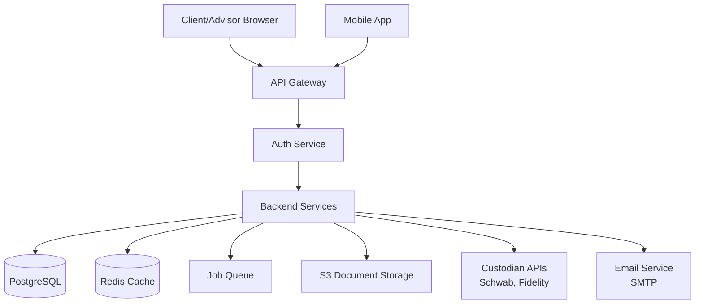
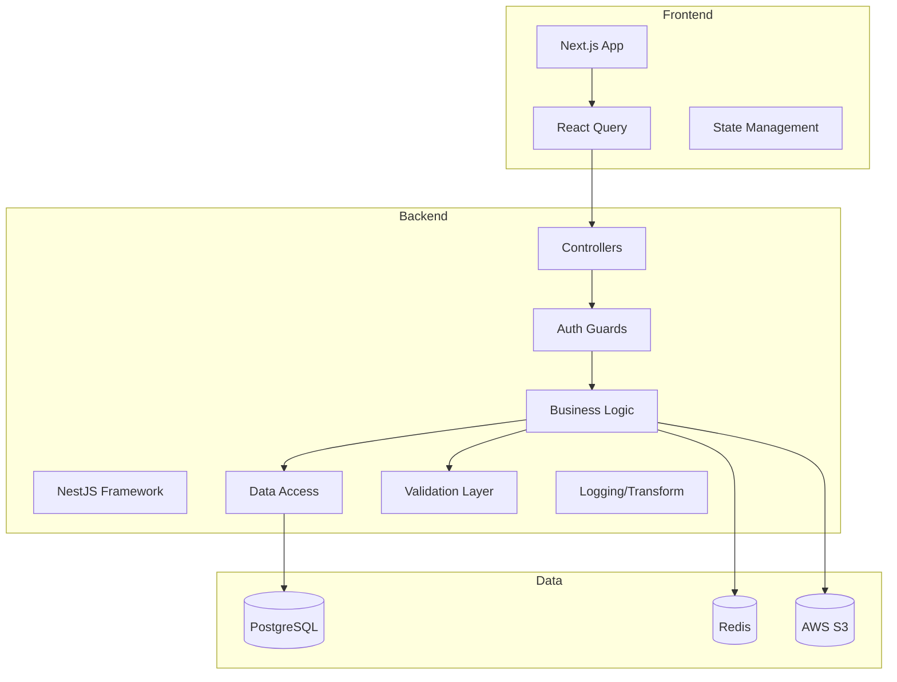
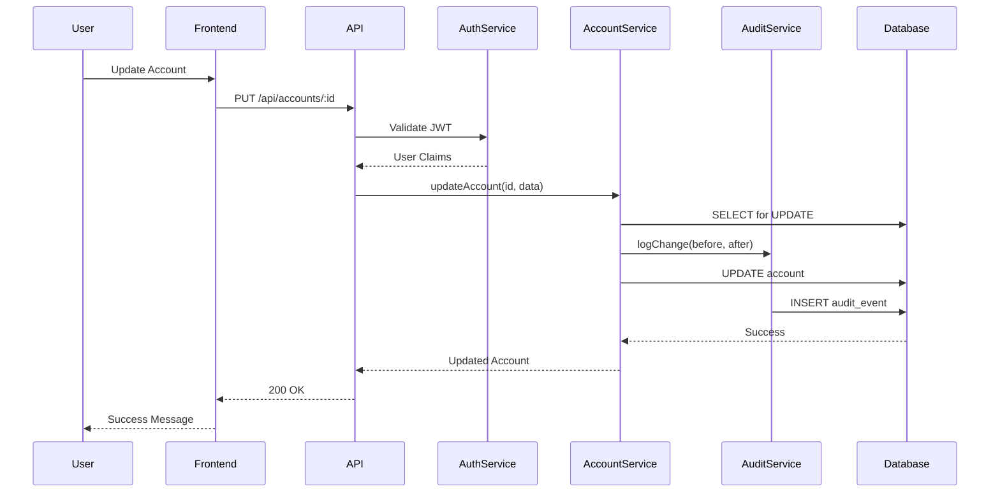
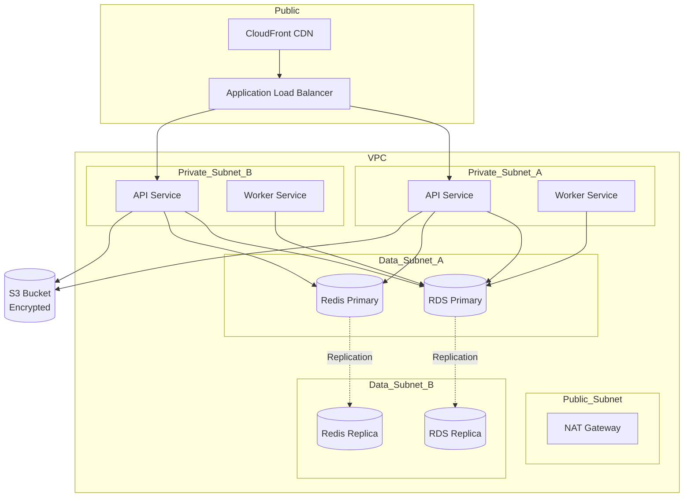

# System Architecture - Wealth Management CRM

## Table of Contents
- [System Overview](#system-overview)
- [Design Philosophy](#design-philosophy)
- [Core Domain Models](#core-domain-models)
- [Architecture Diagrams](#architecture-diagrams)
- [Security Architecture](#security-architecture)
- [Compliance Requirements](#compliance-requirements)
- [Technology Stack](#technology-stack)
- [Deployment Architecture](#deployment-architecture)
- [Scalability Considerations](#scalability-considerations)
- [Disaster Recovery & Business Continuity](#disaster-recovery--business-continuity)

## System Overview

The Wealth Management CRM is an enterprise-grade customer relationship management system designed specifically for SEC-registered investment advisors (RIAs). The system is built to support fiduciary workflows, maintain comprehensive audit trails, manage complex household and entity relationships, and ensure full regulatory compliance.

### Key Capabilities
- **Household & Entity Management**: Support for complex family structures, trusts, foundations, and corporate entities
- **Account Management**: Multi-custodian account tracking with real-time position management
- **Investment Management**: Portfolio construction, rebalancing, and trade execution tracking
- **Compliance & Audit**: Comprehensive audit trails, SEC exam preparation, and regulatory reporting
- **Document Management**: Secure storage and retrieval of client documents with retention policies
- **Communication Tracking**: Complete archive of all client communications for regulatory compliance

## Design Philosophy

### Principles
1. **Security First**: All data is encrypted at rest and in transit; zero-trust architecture
2. **Audit Everything**: Complete audit trail for all data modifications and access
3. **Compliance by Design**: Regulatory requirements embedded in business logic
4. **Data Integrity**: Strong typing, validation, and referential integrity at all layers
5. **Scalability**: Designed to support 10,000+ households and millions of transactions
6. **Maintainability**: Clear separation of concerns, comprehensive documentation
7. **Performance**: Sub-second response times for 95% of user interactions

### Architectural Patterns
- **Domain-Driven Design (DDD)**: Business logic organized around core domain entities
- **CQRS (Command Query Responsibility Segregation)**: Separate read and write models for complex queries
- **Event Sourcing**: Critical business events stored as immutable event log
- **Microservices-Ready**: Modular design allows future service extraction
- **API-First**: All functionality exposed through well-defined REST APIs

## Core Domain Models

### 1. Household
The household is the primary organizational unit representing a family or group of related individuals.

**Key Attributes:**
- `id`: UUID - Unique identifier
- `name`: String - Display name (e.g., "Smith Family")
- `type`: Enum - FAMILY, INDIVIDUAL, TRUST, FOUNDATION, CORPORATION
- `status`: Enum - PROSPECT, ACTIVE, INACTIVE, CLOSED
- `primary_advisor_id`: UUID - Assigned financial advisor
- `service_model`: Enum - WEALTH_MANAGEMENT, FINANCIAL_PLANNING, INVESTMENT_ONLY
- `fee_schedule`: JSONB - Custom fee arrangements
- `aum`: Decimal - Assets Under Management (calculated)
- `created_at`: Timestamp
- `updated_at`: Timestamp

**Relationships:**
- Has many: Persons (members)
- Has many: Accounts
- Has many: Entities (related legal entities)
- Has many: Documents
- Belongs to: Advisor (primary)

**Business Rules:**
- Must have at least one person designated as primary contact
- Status transitions must be audited
- AUM recalculated daily from account positions
- Closed households retain data for 6+ years (SEC requirement)

### 2. Person
Represents an individual human being with PII protection.

**Key Attributes:**
- `id`: UUID
- `first_name`: String (encrypted)
- `last_name`: String (encrypted)
- `middle_name`: String (encrypted, nullable)
- `date_of_birth`: Date (encrypted)
- `ssn`: String (encrypted, masked in UI)
- `citizenship`: String
- `marital_status`: Enum
- `employment_status`: String
- `tax_filing_status`: Enum
- `email`: String (encrypted)
- `phone`: String (encrypted)
- `address`: JSONB (encrypted)
- `kyc_status`: Enum - PENDING, VERIFIED, EXPIRED
- `kyc_verified_date`: Date
- `accredited_investor`: Boolean
- `qualified_client`: Boolean
- `pep_status`: Boolean (Politically Exposed Person)
- `created_at`: Timestamp
- `updated_at`: Timestamp

**Relationships:**
- Belongs to many: Households
- Has many: HouseholdRoles (e.g., CLIENT, SPOUSE, DEPENDENT)
- Has many: AccountOwners (ownership in accounts)
- Has many: Documents

**Business Rules:**
- SSN must be unique or null
- KYC must be reverified every 2 years
- Email required for primary contacts
- PII must be encrypted at rest using AES-256-GCM

### 3. Entity
Legal entities such as trusts, LLCs, foundations, etc.

**Key Attributes:**
- `id`: UUID
- `name`: String
- `type`: Enum - TRUST, LLC, CORPORATION, PARTNERSHIP, FOUNDATION, ESTATE
- `tax_id`: String (encrypted)
- `state_of_formation`: String
- `formation_date`: Date
- `trustees`: JSONB (for trusts)
- `beneficiaries`: JSONB (for trusts)
- `members`: JSONB (for LLCs)
- `status`: Enum - ACTIVE, DISSOLVED, PENDING
- `created_at`: Timestamp
- `updated_at`: Timestamp

**Relationships:**
- Belongs to many: Households
- Has many: Accounts (owned by entity)
- Has many: Documents

### 4. Account
Financial accounts held at various custodians.

**Key Attributes:**
- `id`: UUID
- `household_id`: UUID
- `account_number`: String (encrypted, last 4 shown)
- `account_name`: String
- `account_type`: Enum - BROKERAGE, IRA, ROTH_IRA, 401K, TRUST, JOINT, etc.
- `custodian`: Enum - SCHWAB, FIDELITY, PERSHING, INTERACTIVEBROKERS, etc.
- `registration`: String (legal account registration)
- `status`: Enum - PENDING, OPEN, CLOSED, RESTRICTED
- `opened_date`: Date
- `closed_date`: Date (nullable)
- `managed`: Boolean (is this a managed account?)
- `discretionary`: Boolean (discretionary trading authority?)
- `billing_method`: Enum - ARREARS, ADVANCE
- `fee_percentage`: Decimal
- `market_value`: Decimal (calculated daily)
- `cash_balance`: Decimal
- `created_at`: Timestamp
- `updated_at`: Timestamp

**Relationships:**
- Belongs to: Household
- Has many: Positions (current holdings)
- Has many: Transactions
- Has many: AccountOwners (persons with ownership)
- Belongs to: Entity (if entity-owned)

**Business Rules:**
- Market value updated at least daily
- Closed accounts retain transaction history indefinitely
- Discretionary accounts require signed IPS (Investment Policy Statement)
- Account numbers must be unique per custodian

### 5. Position
Current holdings in an account.

**Key Attributes:**
- `id`: UUID
- `account_id`: UUID
- `security_id`: UUID
- `quantity`: Decimal
- `cost_basis`: Decimal
- `market_value`: Decimal
- `price`: Decimal
- `price_as_of`: Timestamp
- `unrealized_gain_loss`: Decimal (calculated)
- `lot_details`: JSONB (for tax lot tracking)
- `updated_at`: Timestamp

**Relationships:**
- Belongs to: Account
- Belongs to: Security

### 6. Security
Investment securities (stocks, bonds, ETFs, mutual funds).

**Key Attributes:**
- `id`: UUID
- `symbol`: String (ticker)
- `cusip`: String (unique identifier)
- `name`: String
- `security_type`: Enum - EQUITY, FIXED_INCOME, MUTUAL_FUND, ETF, OPTION, etc.
- `asset_class`: Enum - US_EQUITY, INTL_EQUITY, BONDS, CASH, ALTERNATIVES
- `sector`: String
- `price`: Decimal (latest)
- `price_updated_at`: Timestamp
- `active`: Boolean

### 7. Transaction
Historical transactions (trades, deposits, withdrawals).

**Key Attributes:**
- `id`: UUID
- `account_id`: UUID
- `transaction_date`: Date
- `settlement_date`: Date
- `type`: Enum - BUY, SELL, DIVIDEND, INTEREST, DEPOSIT, WITHDRAWAL, FEE, etc.
- `security_id`: UUID (nullable for cash transactions)
- `quantity`: Decimal
- `price`: Decimal
- `amount`: Decimal
- `fee`: Decimal
- `description`: String
- `created_at`: Timestamp

**Relationships:**
- Belongs to: Account
- Belongs to: Security (if applicable)

**Business Rules:**
- Transactions are immutable once settlement_date has passed
- All transactions must balance (debits = credits)

### 8. AuditEvent
Comprehensive audit trail for all system activities.

**Key Attributes:**
- `id`: UUID
- `event_type`: Enum - CREATE, UPDATE, DELETE, ACCESS, LOGIN, EXPORT, etc.
- `entity_type`: String (e.g., "household", "account", "person")
- `entity_id`: UUID
- `user_id`: UUID
- `timestamp`: Timestamp
- `ip_address`: String
- `user_agent`: String
- `changes`: JSONB (before/after values)
- `metadata`: JSONB (additional context)

**Business Rules:**
- Audit records are immutable and retained for 7 years minimum
- Partitioned by month for performance
- All PII access must be logged

### 9. Document
Secure document storage with retention policies.

**Key Attributes:**
- `id`: UUID
- `household_id`: UUID
- `person_id`: UUID (nullable)
- `name`: String
- `document_type`: Enum - IPS, CLIENT_AGREEMENT, FORM_ADV, TAX_RETURN, etc.
- `file_path`: String (encrypted S3 path)
- `file_size`: Integer
- `mime_type`: String
- `uploaded_by`: UUID
- `uploaded_at`: Timestamp
- `retention_until`: Date (calculated based on type)
- `encrypted`: Boolean
- `checksum`: String (SHA-256)

**Business Rules:**
- Client agreements retained for 6 years after termination
- Form ADV archived annually
- Documents encrypted at rest in S3 with KMS

### 10. Communication
Archive of all client communications.

**Key Attributes:**
- `id`: UUID
- `household_id`: UUID
- `person_id`: UUID (nullable)
- `type`: Enum - EMAIL, PHONE, MEETING, LETTER
- `direction`: Enum - INBOUND, OUTBOUND
- `subject`: String
- `body`: Text (encrypted)
- `participants`: JSONB
- `timestamp`: Timestamp
- `attachments`: JSONB
- `created_by`: UUID

**Business Rules:**
- All client communications retained for 6 years
- Emails archived automatically via integration
- Meeting notes must include date, attendees, and topics

## Architecture Diagrams

### System Context Diagram

### Application Architecture

### Data Flow - Account Update

## Security Architecture

### Encryption Strategy

**Data at Rest:**
- PII fields encrypted using AES-256-GCM
- Separate encryption keys per data classification
- Keys stored in AWS KMS with automatic rotation
- Database-level encryption using PostgreSQL pgcrypto

**Data in Transit:**
- TLS 1.3 for all API communications
- Certificate pinning for mobile apps
- VPN required for admin access to production

### Authentication & Authorization

**Authentication:**
- JWT-based authentication with short-lived access tokens (1 hour)
- Refresh tokens with 7-day expiration
- MFA required for all users (TOTP or SMS)
- Password requirements: 12+ characters, complexity rules, no reuse of last 5

**Authorization:**
- Role-Based Access Control (RBAC) with fine-grained permissions
- Row-Level Security (RLS) in PostgreSQL
- API-level authorization checks on every request
- Principle of least privilege

### RBAC Model

**Roles:**
1. **Super Admin**: Full system access (internal IT only)
2. **Compliance Officer**: Access to all households for audit/review
3. **Lead Advisor**: Full access to assigned households
4. **Associate Advisor**: Read/write access to assigned households
5. **Client Service**: Read access, limited write (contacts, communications)
6. **Operations**: Account opening, document management
7. **Read Only**: View-only access for reporting

**Permissions Matrix:**
See `/SECURITY.md` for complete permissions matrix.

### Data Classification

- **Highly Sensitive**: SSN, account numbers, tax IDs - encrypted, masked
- **Sensitive**: Names, addresses, phone, email - encrypted
- **Internal**: Household notes, meeting notes - access controlled
- **Public**: Security prices, market data - no restrictions

## Compliance Requirements

### SEC Regulations

**Rule 204-2 (Books & Records):**
- Client agreements retained 6 years after termination
- Investment advisory contracts
- Records of all accounts showing securities transactions
- Written communications related to advisory business
- IPS (Investment Policy Statement) for each managed account

**Form ADV:**
- Part 2A/2B delivered annually to clients
- Stored in document management system
- Material changes require immediate delivery

**Rule 206(4)-7 (Compliance Program):**
- Annual compliance review documented
- Policies and procedures documented and versioned
- Quarterly access reviews
- Annual BCP testing

### Audit Trail Requirements

**Required Audit Events:**
- All data modifications (create, update, delete)
- User authentication (login, logout, failed attempts)
- PII access (view, export)
- Permission changes
- Configuration changes
- Bulk exports
- API calls from external systems

**Audit Retention:**
- Minimum 7 years
- Immutable storage (append-only)
- Regular integrity checks
- Geographically distributed backups

### Data Retention Policy

| Document Type | Retention Period | Trigger |
|--------------|------------------|---------|
| Client Agreements | 6 years | After termination |
| Form ADV | 6 years | After filing |
| Trade Confirmations | 6 years | After trade date |
| Account Statements | 6 years | After statement date |
| Correspondence | 6 years | After date |
| IPS | Life of account + 6 years | After account closure |
| Meeting Notes | 6 years | After meeting date |

## Technology Stack

### Backend
- **Framework**: NestJS (Node.js/TypeScript)
  - Enterprise-grade framework with excellent TypeScript support
  - Built-in dependency injection, validation, and testing
  - Modular architecture supports scaling
- **Database**: PostgreSQL 15+
  - ACID compliance for financial data
  - JSON/JSONB support for flexible schemas
  - Row-level security for data isolation
  - Excellent performance with proper indexing
- **ORM**: TypeORM
  - TypeScript-native
  - Migration support
  - Query builder for complex queries
- **Cache**: Redis
  - Session storage
  - Query result caching
  - Rate limiting
- **Queue**: Bull (Redis-backed)
  - Async job processing
  - Position updates, report generation

### Frontend
- **Framework**: Next.js 14 (React)
  - Server-side rendering for performance
  - File-based routing
  - API routes for BFF pattern
- **State Management**: Zustand
  - Lightweight, TypeScript-friendly
  - Less boilerplate than Redux
- **Data Fetching**: TanStack Query (React Query)
  - Automatic caching and refetching
  - Optimistic updates
  - Background synchronization
- **Forms**: React Hook Form + Zod
  - Type-safe validation
  - Excellent performance
- **UI**: Tailwind CSS
  - Utility-first CSS
  - Consistent design system
  - Excellent developer experience

### Infrastructure
- **Cloud Provider**: AWS
  - EC2/ECS for compute
  - RDS for PostgreSQL
  - ElastiCache for Redis
  - S3 for document storage
  - CloudFront for CDN
  - Route 53 for DNS
- **IaC**: Terraform
  - Version-controlled infrastructure
  - Reproducible environments
- **Container Orchestration**: Kubernetes (EKS)
  - Auto-scaling
  - Rolling deployments
  - Self-healing
- **CI/CD**: GitHub Actions
  - Automated testing
  - Deployment pipelines
  - Security scanning

### Security & Monitoring
- **Authentication**: Auth0 or AWS Cognito
- **Secrets Management**: AWS Secrets Manager
- **Encryption**: AWS KMS
- **Monitoring**: DataDog or New Relic
- **Logging**: ELK Stack (Elasticsearch, Logstash, Kibana)
- **Error Tracking**: Sentry
- **Security Scanning**: Snyk, SonarQube

## Deployment Architecture

### Environments

1. **Development**: Local Docker Compose
2. **Staging**: AWS EKS (mirrors production)
3. **Production**: AWS EKS with multi-AZ deployment

### Production Architecture

### High Availability
- Multi-AZ deployment across 3 availability zones
- Auto-scaling groups for API and worker services
- RDS Multi-AZ with automatic failover
- Redis cluster mode with replicas
- S3 with cross-region replication for critical documents

### Zero-Downtime Deployments
- Blue/green deployments via Kubernetes
- Health checks before routing traffic
- Automatic rollback on failure
- Database migrations run separately, before deployment

## Scalability Considerations

### Current Scale (Year 1)
- 1,000 households
- 5,000 accounts
- 100,000 positions
- 10 concurrent users
- 100 req/sec peak

### Target Scale (Year 5)
- 10,000 households
- 50,000 accounts  
- 1,000,000 positions
- 100 concurrent users
- 1,000 req/sec peak

### Scaling Strategy

**Horizontal Scaling:**
- Stateless API services scale independently
- Kubernetes HPA (Horizontal Pod Autoscaler) based on CPU/memory
- Worker services scale based on queue depth

**Database Scaling:**
- Read replicas for reporting queries
- Partitioning for audit_events table (monthly partitions)
- Connection pooling with PgBouncer
- Query optimization and indexing strategy

**Caching Strategy:**
- Redis for frequently accessed data (households, accounts)
- CDN for static assets
- API response caching for immutable data (historical prices)

**Data Archival:**
- Closed accounts moved to archive tables after 2 years
- Audit events older than 3 years moved to cold storage (S3)
- Query performance maintained through partitioning

## Disaster Recovery & Business Continuity

### Backup Strategy

**Database Backups:**
- Automated daily snapshots (retained 30 days)
- Transaction log shipping (15-minute RPO)
- Cross-region backup replication
- Monthly full backups to S3 Glacier (7-year retention)

**Document Backups:**
- S3 versioning enabled
- Cross-region replication to DR region
- S3 Glacier for long-term retention

**Application Backups:**
- Docker images stored in ECR
- Infrastructure as Code in version control
- Configuration in AWS Systems Manager Parameter Store

### Recovery Objectives

- **RTO (Recovery Time Objective)**: 4 hours
- **RPO (Recovery Point Objective)**: 15 minutes

### Disaster Recovery Plan

**Scenarios:**
1. **Single Service Failure**: Kubernetes auto-heals, no manual intervention
2. **Availability Zone Failure**: Automatic failover to other AZs
3. **Region Failure**: Manual failover to DR region (4 hour RTO)
4. **Data Corruption**: Restore from point-in-time backup

**DR Testing:**
- Quarterly DR drills
- Annual full failover test
- Documented runbooks for each scenario

### Business Continuity

**Critical Operations (< 4 hours):**
- Client data access
- Position viewing
- Trade entry
- Communication logging

**Important Operations (< 24 hours):**
- Reporting
- Document upload
- Billing
- Performance calculations

**Normal Operations (< 72 hours):**
- Historical analysis
- Compliance reviews
- System administration

---

**Document Version**: 1.0  
**Last Updated**: 2024-12-22  
**Owner**: Engineering Team  
**Review Cycle**: Quarterly
