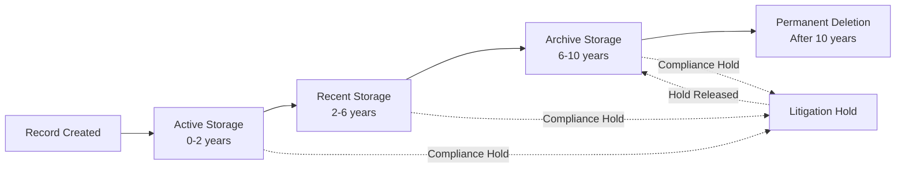

# Compliance Framework - Wealth Management CRM

## Table of Contents
- [Overview](#overview)
- [SEC Regulations](#sec-regulations)
- [State Regulations](#state-regulations)
- [Audit Trail Requirements](#audit-trail-requirements)
- [Data Retention Policies](#data-retention-policies)
- [Exam Preparation](#exam-preparation)
- [Regulatory Reporting](#regulatory-reporting)
- [Client Communication Archiving](#client-communication-archiving)
- [Fiduciary Duty Documentation](#fiduciary-duty-documentation)
- [Compliance Workflows](#compliance-workflows)

## Overview

This document outlines the comprehensive compliance framework for the Wealth Management CRM, designed to meet SEC registration requirements for Registered Investment Advisors (RIAs), state securities regulations, and fiduciary duty standards.

### Regulatory Landscape

**Federal Regulations:**
- Investment Advisers Act of 1940
- SEC Rules 204-2 (Books and Records)
- SEC Rule 206(4)-7 (Compliance Programs)
- Form ADV (Registration and Disclosure)
- Regulation S-P (Privacy)
- Regulation S-ID (Identity Theft Red Flags)

**State Regulations:**
- Uniform Securities Act
- State-specific investment adviser requirements
- Notice filing requirements
- State examination procedures

**Industry Standards:**
- CFA Institute Code of Ethics
- CFP Board Standards
- NAPFA Fiduciary Oath
- Best Interest Standard (Regulation BI for broker-dealers)

### Compliance Principles

1. **Fiduciary Standard**: Always act in client's best interest
2. **Disclosure**: Full and fair disclosure of material facts
3. **Documentation**: Comprehensive records of all advisory activities
4. **Supervision**: Adequate supervision of advisory personnel
5. **Policies & Procedures**: Written policies covering all aspects of advisory business
6. **Testing**: Regular testing and review of compliance procedures

## SEC Regulations

### Investment Advisers Act of 1940

**Registration Requirements:**
- Form ADV Part 1: Registration information
- Form ADV Part 2: Disclosure brochure
- Annual updating amendment within 90 days of fiscal year end
- Material changes require prompt amendment

**System Support:**
- Store current and historical Form ADV documents
- Track amendment dates and material changes
- Workflow for annual review and update
- Client delivery tracking (Part 2 within 120 days of fiscal year end)

### SEC Rule 204-2: Books and Records

#### Required Records

**1. Advisory Contracts (Rule 204-2(a)(1))**
- All investment advisory contracts
- Must include: services provided, fee schedule, termination provisions
- Retention: 6 years from termination (first 2 years in principal office)

**System Implementation:**
- Document type: "Investment Advisory Agreement"
- Automatic retention calculation from termination date
- Searchable by client, date, and status
- Version control for contract amendments

**2. Cash Receipts and Disbursements (Rule 204-2(a)(2))**
- Journals of all cash transactions
- Ledgers showing all assets, liabilities, reserves
- Checkbooks, bank statements, cancelled checks

**System Implementation:**
- Billing and payment tracking module
- Integration with accounting system
- Monthly reconciliation workflows

**3. Securities Records (Rule 204-2(a)(3))**
- Record of all securities recommended to clients
- Record of all securities purchased and sold for clients
- Dates of transactions, prices, and principals

**System Implementation:**
- Investment proposal tracking
- Trade order management
- Transaction history by account
- Performance attribution reports

**4. Order Memoranda (Rule 204-2(a)(3)(i))**
- Terms and conditions of each order
- Instructions given by client
- Time of entry
- Account for which entered
- Time of execution and price

**System Implementation:**
- Trade order capture with timestamp
- Client instruction documentation
- Execution details from custodian feeds
- Best execution monitoring

**5. Trial Balances (Rule 204-2(a)(4))**
- Securities held in custody for clients
- Trial balance monthly for each account

**System Implementation:**
- Monthly position reconciliation
- Custodian data feeds
- Variance reporting
- Investigation workflow for discrepancies

**6. Written Communications (Rule 204-2(a)(7))**
- All written communications sent or received relating to:
  - Recommendations made
  - Advice given
  - Receipt, disbursement, or delivery of funds/securities
  - Placing or execution of orders

**System Implementation:**
- Email archiving integration (e.g., Smarsh, Global Relay)
- Meeting notes capture
- Letter/document correspondence tracking
- Search functionality across all communications

**7. Client Lists (Rule 204-2(a)(8))**
- Name and address of each client
- Last known as of the end of the adviser's fiscal year

**System Implementation:**
- Household directory
- Annual snapshot generation
- Address history tracking
- Active/inactive status with dates

**8. Performance Records (Rule 204-2(a)(16))**
- Records to support performance calculations
- All accounts included in composites
- Account additions/deletions with reasons

**System Implementation:**
- Performance calculation engine
- Composite management
- Time-weighted and dollar-weighted returns
- Benchmark comparison

**9. Form ADV and Amendments (Rule 204-2(a)(8))**
- Copies of all Form ADV filings
- Copies of notices, applications, reports, and correspondence

**System Implementation:**
- Document repository for Form ADV
- Amendment tracking with version control
- Client delivery confirmation tracking

**10. Investment Policy Statement (IPS)**
- While not explicitly required by 204-2, essential for fiduciary duty
- Documents client objectives, risk tolerance, constraints

**System Implementation:**
- IPS template management
- Client-specific IPS creation
- Annual review workflow
- Signature capture and storage

### SEC Rule 206(4)-7: Compliance Programs

**Requirements:**
- Written policies and procedures
- Annual review of compliance program
- Designated chief compliance officer (CCO)
- Policies reasonably designed to prevent violations

**System Support:**
- Compliance manual repository
- Annual review workflow and sign-off tracking
- Policy version control
- CCO dashboard for monitoring

**Required Policies:**
1. Portfolio management processes
2. Trading practices (best execution, allocation, cross trades)
3. Proprietary trading conflicts
4. Accuracy of disclosures
5. Safeguarding client assets
6. Marketing and advertising
7. Valuation of client holdings
8. Safeguards for privacy protection
9. Business continuity
10. Supervision of employees
11. Code of ethics
12. Insider trading

**System Features:**
- Policy acknowledgment tracking
- Training completion tracking
- Annual certification workflow
- Policy distribution management

### Form ADV Requirements

**Part 1: Registration Information**
- Business operations and ownership
- Control persons and advisory affiliates
- Assets under management
- Types of clients
- Disciplinary history

**Part 2A: Firm Brochure**
- Services offered
- Fees and compensation
- Disciplinary information
- Conflicts of interest
- Code of ethics

**Part 2B: Brochure Supplements**
- Biographical information for supervised persons
- Educational background and business experience
- Disciplinary information

**System Implementation:**
- Annual AUM calculation from account data
- Workflow for 90-day annual update
- Material change detection
- Client delivery tracking
- Acknowledgment collection

### Regulation S-P: Privacy

**Requirements:**
- Privacy notice at account opening
- Annual privacy notice (if sharing nonpublic information)
- Opt-out rights if sharing with nonaffiliated third parties
- Safeguards to protect customer information

**System Implementation:**
- Privacy notice versioning
- Delivery tracking (electronic or mail)
- Opt-in/opt-out preference management
- Third-party data sharing agreements

## State Regulations

### State Registration Requirements

**State-Registered Advisers (AUM < $100M):**
- Register with state securities regulator
- File Form ADV with state
- May require surety bond
- State examinations more frequent than SEC

**Notice-Filed Advisers (AUM > $100M):**
- SEC-registered but file notice in states
- Pay state filing fees
- Subject to state regulations and examinations

**System Implementation:**
- Track registration status by state
- State filing deadline calendar
- Renewal reminders and workflow
- State-specific form generation

### State Examination Preparation

**Common State Exam Focus Areas:**
- Client files completeness
- Fee billing accuracy
- Marketing materials review
- ADV accuracy
- Custody rule compliance (if applicable)
- Employee files and supervision

**System Features:**
- Mock examination report generator
- Client file completeness checklist
- Fee billing audit trail
- Marketing material approval workflow
- Employee supervision documentation

### Uniform Securities Act Compliance

**Recordkeeping:**
- Generally aligns with SEC Rule 204-2
- Some states have additional requirements
- Retention period typically 6 years

**Advertising:**
- Testimonials may be prohibited or restricted
- Performance advertising must be fair and balanced
- Filing requirement for advertisements in some states

**System Implementation:**
- State-specific advertising compliance checks
- Performance calculation with required disclosures
- Testimonial approval workflow with state restrictions

## Audit Trail Requirements

### Entity-Specific Audit Trails

#### Household Audit Trail
**Captured Events:**
- Household creation (date, created_by)
- Status changes (prospect → active → inactive → closed)
- Primary advisor changes
- Service model changes
- Fee schedule modifications
- AUM recalculations

**Audit Fields:**
```json
{
  "entity_type": "household",
  "entity_id": "uuid",
  "event_type": "STATUS_CHANGE",
  "timestamp": "2024-12-22T10:30:00Z",
  "user_id": "user-uuid",
  "changes": {
    "field": "status",
    "old_value": "PROSPECT",
    "new_value": "ACTIVE"
  },
  "metadata": {
    "reason": "Signed investment advisory agreement",
    "agreement_document_id": "doc-uuid"
  }
}
```

#### Account Audit Trail
**Captured Events:**
- Account opening
- Account closure
- Account number changes
- Registration changes
- Fee percentage changes
- Discretionary authority changes
- Managed status changes

**Compliance Purpose:**
- Demonstrate proper account setup
- Track fee billing changes
- Document discretionary authority
- Support custody rule compliance

#### Person (PII) Audit Trail
**Captured Events:**
- Person record creation
- Any PII field access (SSN view, DOB view)
- PII field modifications
- KYC status changes
- Accredited investor determination
- Client status changes

**Compliance Purpose:**
- Privacy compliance (Regulation S-P)
- Identity theft prevention
- KYC/AML documentation
- Suitability determination support

#### Transaction Audit Trail
**Captured Events:**
- Trade order creation
- Trade execution
- Trade modification or cancellation
- Allocation changes
- Settlement failures

**Compliance Purpose:**
- Best execution documentation
- Trade error investigation
- Fair allocation demonstration
- Principal transaction disclosure

#### Document Audit Trail
**Captured Events:**
- Document upload
- Document download/view
- Document deletion
- Retention period modification
- Document sharing

**Compliance Purpose:**
- Document retention compliance
- Client file completeness
- Privacy protection
- eDiscovery support

#### Communication Audit Trail
**Captured Events:**
- Email sent/received
- Phone call logged
- Meeting scheduled/completed
- Letter sent
- Text message (if business-related)

**Compliance Purpose:**
- Written communication retention (Rule 204-2)
- Supervision documentation
- Client instruction verification
- Suitability determination support

### Audit Log Retention

**Primary Storage:**
- PostgreSQL partitioned table
- 7-year retention in active database
- Monthly partitions for performance
- Indexed by entity_type, entity_id, user_id, timestamp

**Archive Storage:**
- Logs > 2 years moved to S3
- Compressed and encrypted
- Glacier Deep Archive for cost efficiency
- 10-year total retention

**Audit Log Query Interface:**
- Search by entity, date range, user, event type
- Export to CSV for regulatory requests
- Real-time filtering and aggregation
- Compliance officer dashboard

## Data Retention Policies

### SEC Retention Requirements (Rule 204-2)

| Record Type | Retention Period | Location Requirement |
|-------------|------------------|---------------------|
| Investment Advisory Agreements | 6 years from termination | First 2 years in principal office |
| Written Communications | 6 years | First 2 years in accessible place |
| Trade Orders | 6 years | First 2 years in accessible place |
| Performance Records | 6 years | First 2 years in accessible place |
| Form ADV and Amendments | 6 years from filing | First 2 years in principal office |
| Client Lists | Current fiscal year end | Accessible place |
| Cash Journals/Ledgers | 6 years | First 2 years in accessible place |
| Trial Balances | 6 years | First 2 years in accessible place |

### System Retention Policy

**Active Records (0-2 years):**
- Primary PostgreSQL database
- Full search and modification capabilities
- Real-time access for advisors

**Recent Records (2-6 years):**
- PostgreSQL with some data on S3
- Full search capabilities
- Slightly slower access (acceptable for compliance reviews)

**Archive Records (6+ years):**
- S3 with Glacier Deep Archive
- Search via restore request (24-48 hours)
- Retained for 10 years for additional safety margin
- Immutable storage

**Retention Workflow:**


**Litigation Hold:**
- Override automatic deletion
- Flag records related to legal matters
- Retain until explicit release
- Audit trail of hold placement and release

### Retention Triggers

**Household Closure:**
- Trigger date: Account closure date or termination of advisory relationship
- Retention start: Date of household closure
- Documents retained: All documents associated with household
- Calculation: Automatic retention_until date set to closure_date + 6 years

**Document Upload:**
- Trigger date: Upload date
- Retention period: Based on document type
- Form ADV: 6 years from filing date
- IPS: 6 years from account closure
- Meeting notes: 6 years from meeting date
- Client agreements: 6 years from termination

**Communication Archival:**
- Email: Archived immediately, retained 6 years from date
- Phone logs: Retained 6 years from call date
- Meeting notes: Retained 6 years from meeting date

### Retention Monitoring

**Compliance Dashboard:**
- Records approaching retention expiration
- Records eligible for archive migration
- Records on litigation hold
- Storage costs by record type and age

**Automated Processes:**
- Daily job identifies records eligible for migration
- Weekly job migrates records to archive tier
- Monthly job purges records past retention + litigation hold check
- Quarterly retention policy review report

## Exam Preparation

### SEC Examination Process

**Examination Types:**
1. **Routine**: Scheduled periodic examination
2. **Cause**: Triggered by red flags, complaints, or referrals
3. **Sweep**: Industry-wide focused on specific topic

**Examination Phases:**
1. **Notification**: 30-60 days advance notice
2. **Information Request**: Document production
3. **On-site Visit**: Interviews and system review
4. **Deficiency Letter**: Findings requiring response
5. **Closure**: Resolved or enforcement action

### Pre-Examination Preparation

**Mock Examination (Annual):**
- Internal compliance review mimicking SEC process
- Random sample of client files
- Marketing materials review
- Fee billing verification
- ADV accuracy check
- Trading practices review

**System-Generated Reports:**
1. **Client File Completeness Report**
   - All active households
   - Required documents checklist
   - Missing documents highlighted
   - Last review date

2. **Fee Billing Audit Report**
   - Calculated fees vs. billed fees
   - Variance analysis
   - Fee schedule changes tracking
   - Discount approval documentation

3. **ADV Accuracy Report**
   - AUM from system vs. Form ADV Part 1
   - Client types from system vs. ADV
   - Services offered alignment
   - Disciplinary disclosures

4. **Performance Advertising Compliance**
   - All marketing materials with performance claims
   - Calculation methodology verification
   - Required disclosures present
   - Composite compliance

5. **Supervision Documentation**
   - Employee supervision procedures
   - Review sign-offs and dates
   - Training completion
   - Code of ethics acknowledgments

### Document Production Request

**Typical SEC Document Requests:**
- Form ADV and all amendments
- Policies and procedures manual
- Sample client agreements (25-50)
- Sample client files (25-50)
- Trading records for selected period
- Marketing materials
- Employee files
- Compliance meeting minutes
- Annual compliance review
- Business continuity plan

**System Export Capabilities:**
- Bulk document export by household
- Audit trail export by date range
- Communication history export
- Trade history export
- Performance reports with calculation details
- Policy version history

**Response Workflow:**
1. Document request received → logged in system
2. Compliance officer assigns items to team members
3. Team members gather documents
4. Compliance officer reviews for completeness
5. Legal review (if sensitive)
6. Submission via SEC portal
7. Track examiner follow-up questions

### Common Examination Findings

**Inadequate Compliance Program:**
- Missing required policies
- Annual review not conducted
- CCO not adequately empowered

**System Support:**
- Policy repository with version control
- Annual review workflow with sign-off tracking
- CCO dashboard with red flags

**Deficient Form ADV:**
- AUM inaccurate
- Services not properly described
- Conflicts not disclosed

**System Support:**
- Automatic AUM calculation
- Service catalog with ADV mapping
- Conflict of interest register

**Fee Billing Errors:**
- Overbilling clients
- Incorrect calculation methodology
- Discounts not properly applied

**System Support:**
- Automated fee calculation
- Fee schedule version control
- Discount approval workflow
- Billing reconciliation reports

**Inadequate Supervision:**
- No evidence of supervision
- Supervision procedures not followed
- Training not documented

**System Support:**
- Supervisor review workflows
- Training module with completion tracking
- Random trade review requirements
- Email review processes

### Post-Examination Response

**Deficiency Letter Response:**
- Acknowledge findings
- Provide explanation or correction
- Detail remediation steps
- Commit to timeline
- Implement enhanced procedures

**System Tracking:**
- Examination findings log
- Remediation task assignment
- Completion tracking
- Follow-up exam preparation

## Regulatory Reporting

### Form ADV Filings

**Annual Update (Within 90 Days of Fiscal Year End):**
- Part 1: Update AUM, client counts, business operations
- Part 2: Update firm brochure if material changes
- Deliver updated Part 2 to all clients within 120 days

**Material Changes (Prompt Amendment):**
- Criminal charges or convictions
- New disciplinary events
- Change in control
- Change in business operations
- Change in advisory services

**System Workflow:**
1. Annual reminder 60 days before deadline
2. Generate AUM report from system data
3. Compliance officer reviews and updates Form ADV
4. Legal review if material changes
5. File via IARD system
6. Generate client brochure delivery list
7. Track client delivery (email or mail)
8. Collect delivery confirmations

### State Filings

**Notice Filings (Annual):**
- Due dates vary by state
- Fees vary by state
- Some states require additional forms

**System Support:**
- State registration database
- Filing deadline calendar
- Reminder workflow
- Fee payment tracking

### Performance Reporting

**GIPS Compliance (Optional but Recommended):**
- Global Investment Performance Standards
- Composite construction and maintenance
- Performance calculation methodology
- Required disclosures

**System Features:**
- Time-weighted return calculation
- Composite management
- Benchmark comparison
- GIPS-compliant report generation

### Client Reporting

**Quarterly Reports (Managed Accounts):**
- Account performance
- Holdings summary
- Transaction summary
- Fee deduction detail
- Benchmark comparison

**Annual Reports:**
- Full-year performance
- Capital gains summary
- Fee summary
- Year-over-year comparison

**System Features:**
- Automated report generation
- Client portal access
- PDF delivery via email
- Delivery confirmation tracking

## Client Communication Archiving

### Written Communications (Rule 204-2(a)(7))

**Scope:**
- All emails sent or received relating to advisory business
- All text messages relating to advisory business
- Letters and memos
- Social media direct messages
- Instant messages (Slack, Teams, etc.)

**Exclusions:**
- Personal communications (not relating to advisory business)
- Marketing emails to broad audience (retained under advertising rules)

### Email Archiving

**Implementation:**
- Third-party email archiving service (Smarsh, Global Relay, Proofpoint)
- Archive all email domains used by firm
- Capture before delivery (pre-archiving)
- Retain for 6 years
- Search and eDiscovery capabilities

**System Integration:**
- Link archived emails to household records
- Tag emails by client
- Associate emails with specific activities (e.g., trade orders)

**Supervision Features:**
- Random email review workflow
- Lexicon-based alerts (profanity, conflicts, personal trading)
- Supervisor dashboard for review
- Email review documentation

### Phone Communication Logging

**Implementation:**
- VoIP system integration (if available)
- Manual call logging for mobile/personal phones
- Capture: date, time, duration, participants, purpose, key points

**System Features:**
- Quick call log entry
- Associate with household
- Search by date, client, advisor
- Retention: 6 years

### Meeting Notes

**Requirements:**
- Document date, attendees, topics discussed
- Recommendations made
- Client instructions received
- Questions asked and answered

**System Features:**
- Meeting note template
- Associate with household
- Tag topics (investment review, planning, estate planning, etc.)
- Supervisor review if sensitive recommendations
- Retention: 6 years

### Text Messages (SMS)

**Challenges:**
- Personal devices
- Difficult to archive
- Regulatory scrutiny increasing

**Policy Recommendation:**
- Prohibit business texting on personal devices
- If allowed, require forwarding to email for archiving
- Use approved business messaging platform with archiving

**System Support:**
- Policy acknowledgment tracking
- Training on proper communication channels
- Lexicon monitoring if platform supports

### Social Media Communications

**Regulatory Guidance:**
- LinkedIn messages relating to advisory business must be archived
- Facebook messages (if business-related)
- Twitter DMs (if business-related)

**Implementation:**
- Social media archiving tool (e.g., Smarsh Social)
- Policy restricting business communications to approved channels
- Training on personal vs. business communications

## Fiduciary Duty Documentation

### Best Interest Standard

**Fiduciary Obligations:**
1. **Duty of Care**: Conduct reasonable investigation and provide advice in client's best interest
2. **Duty of Loyalty**: Place client's interests ahead of own; disclose and mitigate conflicts

**System Support:**
- Investment proposal documentation
- Due diligence records for recommendations
- Conflict of interest disclosure tracking
- Client acknowledgment of disclosures

### Investment Policy Statement (IPS)

**Purpose:**
- Document client objectives, risk tolerance, time horizon
- Establish investment strategy and asset allocation
- Set performance benchmarks
- Define rebalancing parameters

**Required Elements:**
- Client goals and objectives
- Risk tolerance assessment
- Time horizon
- Liquidity needs
- Tax considerations
- Special circumstances or constraints
- Asset allocation ranges
- Benchmark(s)
- Rebalancing policy
- Review frequency

**System Features:**
- IPS template management
- Client-specific IPS generation
- Annual review workflow
- Version control
- Signature capture
- Deviation alerts (if account allocation outside IPS ranges)

### Suitability Determination

**Know Your Client (KYC):**
- Financial situation (income, net worth, assets, liabilities)
- Investment experience
- Risk tolerance
- Investment objectives
- Time horizon

**System Capture:**
- Client onboarding questionnaire
- Risk tolerance assessment (quantitative)
- Investment objective selection
- Update workflow (annually or when circumstances change)
- Supervisor review for complex situations

**Suitability Review:**
- Recommendation aligned with IPS
- Risk level appropriate for client
- Concentration risks considered
- Tax implications considered
- Fees reasonable

### Disclosure Requirements

**Initial Disclosure:**
- Form ADV Part 2A (Firm Brochure) before or at time of engagement
- Form ADV Part 2B (Brochure Supplement) for key advisory personnel
- Investment advisory agreement with fee disclosure
- Privacy notice

**Ongoing Disclosure:**
- Material changes to Form ADV (prompt delivery)
- Annual delivery of updated Part 2 (within 120 days)
- Conflicts of interest as they arise
- Trade errors and resolution

**System Tracking:**
- Disclosure document versions
- Client delivery tracking
- Acknowledgment collection
- Annual delivery workflow

### Trade Error Documentation

**Required Documentation:**
- Description of error
- Root cause analysis
- Affected accounts
- Financial impact
- Correction method
- Client notification (if material)
- Steps to prevent recurrence

**System Features:**
- Trade error log
- Investigation workflow
- Client notification template
- Remediation tracking
- Reporting to CCO

## Compliance Workflows

### Annual Compliance Review

**Scope:**
- Review of all compliance policies and procedures
- Testing of procedures
- Review of prior year's activities for violations
- Assessment of regulatory changes
- Update of compliance manual

**Timeline:**
- Complete within 120 days of fiscal year end
- Document findings and updates
- Board of Directors review
- Sign-off by CCO

**System Workflow:**
1. Generate annual review checklist
2. Assign review tasks to team members
3. Complete policy reviews
4. Document findings and recommended changes
5. Update policies
6. Board presentation
7. CCO sign-off
8. Distribute updated policies
9. Collect employee acknowledgments

### Code of Ethics Compliance

**Requirements (Rule 204A-1):**
- Written code of ethics
- Personal securities transactions reporting
- Pre-clearance of certain transactions
- Annual acknowledgment by access persons

**Personal Trading Rules:**
- Pre-clearance for IPOs and private placements
- Quarterly reporting of all transactions
- Annual holdings report
- Blackout periods around client trading

**System Support:**
- Code of ethics repository
- Annual acknowledgment workflow
- Personal trading report submission
- Pre-clearance request and approval
- Blackout period enforcement
- Supervisor review of personal trading

### Outside Business Activities (OBA)

**Requirements:**
- Disclosure of all outside business activities
- Pre-approval by CCO
- Annual recertification
- Monitoring for conflicts

**System Workflow:**
1. Employee submits OBA request
2. CCO reviews for conflicts
3. Approve, approve with conditions, or deny
4. Annual recertification reminder
5. Update if circumstances change
6. Track all OBAs in employee records

### Client Complaint Handling

**Process:**
1. Complaint received (any channel)
2. Log in system immediately
3. Acknowledge to client within 24 hours
4. Assign to appropriate person for investigation
5. Investigate and document findings
6. Resolve with client
7. Remediation if needed
8. CCO review
9. Close complaint with documentation

**System Features:**
- Complaint tracking system
- Automatic escalation for serious complaints
- Regulatory reporting (if required)
- Trending analysis for systemic issues
- Integration with audit trail

### Compliance Testing Program

**Quarterly Testing:**
- Random email review (10% of staff)
- Trade allocation review
- Performance calculation verification
- Fee billing accuracy

**Annual Testing:**
- Client file completeness
- Marketing materials review
- ADV accuracy
- Personal trading compliance
- Employee supervision

**System Support:**
- Testing schedule and reminders
- Random selection for sampling
- Testing results documentation
- Exception tracking and remediation

---

**Document Version**: 1.0  
**Last Updated**: 2024-12-22  
**Owner**: Compliance Department  
**Review Cycle**: Annual  
**Next Review**: 2025-12-22
