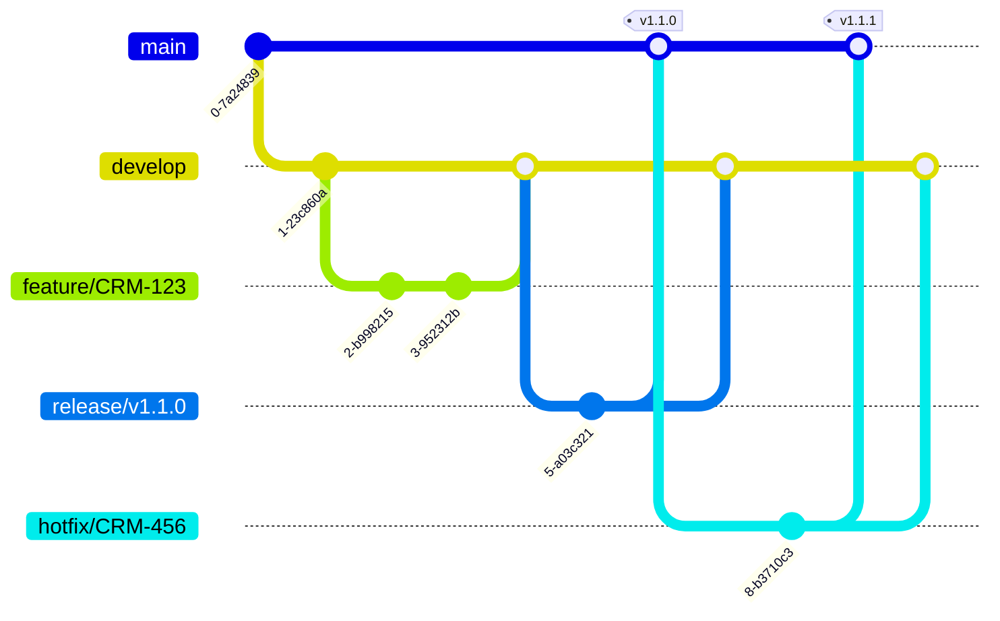

# Contributing to Wealth Management CRM

Thank you for your interest in contributing to our world-class Wealth Management CRM! This document provides guidelines and best practices for contributing to the project.

## Table of Contents
- [Code of Conduct](#code-of-conduct)
- [Getting Started](#getting-started)
- [Development Workflow](#development-workflow)
- [Branch Strategy](#branch-strategy)
- [Commit Message Conventions](#commit-message-conventions)
- [Code Review Standards](#code-review-standards)
- [Testing Requirements](#testing-requirements)
- [Documentation Standards](#documentation-standards)
- [Pull Request Process](#pull-request-process)
- [Security Guidelines](#security-guidelines)

## Code of Conduct

### Our Pledge
We are committed to providing a welcoming and inclusive environment for all contributors. We expect all participants to:

- Use welcoming and inclusive language
- Be respectful of differing viewpoints and experiences
- Gracefully accept constructive criticism
- Focus on what is best for the project and community
- Show empathy towards other community members

### Unacceptable Behavior
- Harassment or discriminatory language
- Personal attacks or insults
- Publishing others' private information
- Trolling or inflammatory comments
- Other conduct that could reasonably be considered inappropriate

## Getting Started

### Prerequisites
- Node.js 18+ and npm
- PostgreSQL 15+
- Redis 7+
- Docker and Docker Compose (for local development)
- Git

### Local Development Setup

1. **Clone the repository:**
   ```bash
   git clone https://github.com/your-org/crm-wealth.git
   cd crm-wealth
   ```

2. **Start infrastructure with Docker Compose:**
   ```bash
   docker-compose up -d postgres redis
   ```

3. **Backend setup:**
   ```bash
   cd backend
   npm install
   cp .env.example .env
   # Edit .env with your local configuration
   npm run migration:run
   npm run seed:dev
   npm run start:dev
   ```

4. **Frontend setup:**
   ```bash
   cd frontend
   npm install
   cp .env.example .env.local
   # Edit .env.local with your local configuration
   npm run dev
   ```

5. **Verify setup:**
   - Backend API: http://localhost:3000
   - Frontend: http://localhost:3001
   - API docs: http://localhost:3000/api/docs

### Development Tools

**Required IDE Extensions (VS Code):**
- ESLint
- Prettier
- EditorConfig
- TypeScript and JavaScript Language Features
- GitLens (recommended)
- REST Client (recommended)

**Recommended Tools:**
- Postman or Insomnia (API testing)
- pgAdmin or DBeaver (database management)
- RedisInsight (Redis management)

## Development Workflow

### Agile Methodology
We follow a two-week sprint cycle with the following ceremonies:

- **Sprint Planning**: First Monday of each sprint
- **Daily Standup**: Every weekday at 9:00 AM
- **Sprint Review**: Last Friday of each sprint
- **Sprint Retrospective**: Last Friday of each sprint

### Story Points and Estimation
- 1 point: Small change (< 2 hours)
- 2 points: Medium change (2-4 hours)
- 3 points: Larger feature (4-8 hours)
- 5 points: Complex feature (1-2 days)
- 8 points: Very complex (2-3 days, consider splitting)
- 13+ points: Epic (must be split into smaller stories)

### Definition of Done
Before marking a story as complete, ensure:

- [ ] Code is written and follows style guide
- [ ] Unit tests written and passing (80%+ coverage)
- [ ] Integration tests written (if applicable)
- [ ] Code reviewed and approved by at least one peer
- [ ] Documentation updated (code comments, API docs, README)
- [ ] Manual testing completed
- [ ] No linting errors or warnings
- [ ] Build succeeds
- [ ] Security scan passes
- [ ] Deployed to dev environment and verified
- [ ] Product owner acceptance

## Branch Strategy

We follow **GitFlow** branching model:

### Branch Types

#### `main`
- Protected branch
- Always deployable to production
- Only accepts merges from `release/*` or `hotfix/*`
- Requires pull request with 2 approvals
- All CI/CD checks must pass

#### `develop`
- Integration branch
- Contains latest development changes
- Source for feature branches
- Automatically deploys to dev environment

#### `feature/*`
- Created from: `develop`
- Naming: `feature/JIRA-123-short-description`
- Purpose: New features or enhancements
- Merged back to: `develop`
- Example: `feature/CRM-456-household-management`

#### `bugfix/*`
- Created from: `develop`
- Naming: `bugfix/JIRA-123-short-description`
- Purpose: Bug fixes for upcoming release
- Merged back to: `develop`

#### `hotfix/*`
- Created from: `main`
- Naming: `hotfix/JIRA-123-short-description`
- Purpose: Critical production bugs
- Merged to: `main` AND `develop`
- Creates new patch version

#### `release/*`
- Created from: `develop`
- Naming: `release/v1.2.0`
- Purpose: Prepare for production release
- Only bug fixes allowed (no new features)
- Merged to: `main` AND `develop`

### Branch Naming Convention

**Format**: `type/ticket-number-brief-description`

**Examples:**
```
feature/CRM-123-add-household-module
bugfix/CRM-456-fix-fee-calculation
hotfix/CRM-789-security-patch
release/v1.2.0
```

**Rules:**
- Use lowercase and hyphens (kebab-case)
- Include ticket number from issue tracker
- Keep description brief but descriptive
- Maximum 50 characters

### Branch Lifecycle



## Commit Message Conventions

We follow **Conventional Commits** specification.

### Format
```
<type>(<scope>): <subject>

<body>

<footer>
```

### Type
- `feat`: New feature
- `fix`: Bug fix
- `docs`: Documentation only
- `style`: Code style changes (formatting, semicolons, etc.)
- `refactor`: Code change that neither fixes a bug nor adds a feature
- `perf`: Performance improvement
- `test`: Adding or modifying tests
- `chore`: Changes to build process or auxiliary tools
- `ci`: Changes to CI/CD configuration
- `revert`: Revert a previous commit

### Scope
Optional, specifies the module affected:
- `households`
- `accounts`
- `persons`
- `auth`
- `compliance`
- `api`
- `ui`

### Subject
- Use imperative mood ("add" not "added" or "adds")
- No capitalization of first letter
- No period at the end
- Maximum 50 characters

### Body
- Optional, provides additional context
- Wrap at 72 characters
- Explain *what* and *why*, not *how*

### Footer
- Optional, references issues or breaking changes
- `BREAKING CHANGE:` for breaking changes
- `Closes #123` or `Fixes #456` for issue references

### Examples

**Feature:**
```
feat(households): add household creation endpoint

Implement POST /api/households endpoint with validation,
authorization, and audit logging.

Closes #CRM-123
```

**Bug Fix:**
```
fix(accounts): correct fee calculation for partial periods

Fee calculation was using 365 days instead of actual days in year.
This caused slight overbilling in non-leap years.

Fixes #CRM-456
```

**Breaking Change:**
```
feat(api): update authentication to use JWT refresh tokens

BREAKING CHANGE: Session-based authentication removed in favor of
JWT with refresh token flow. Clients must update to use new
/auth/refresh endpoint.

Closes #CRM-789
```

**Documentation:**
```
docs(api): add examples for household endpoints

Added request/response examples for all household CRUD operations.
```

## Code Review Standards

### Review Process

1. **Self-Review First:**
   - Review your own code before requesting review
   - Run all tests locally
   - Check linting and formatting
   - Verify documentation is updated

2. **Request Review:**
   - Assign at least one reviewer
   - For complex changes, request multiple reviewers
   - Security changes require security team review
   - Database changes require DBA review

3. **Review Timeline:**
   - Small PRs (< 200 lines): Review within 4 hours
   - Medium PRs (200-500 lines): Review within 1 day
   - Large PRs (500+ lines): Review within 2 days
   - Consider splitting large PRs

4. **Approval Requirements:**
   - At least 1 approval required for `develop`
   - At least 2 approvals required for `main`
   - All conversations resolved
   - All CI checks passing

### What to Look For

**Code Quality:**
- [ ] Code is clean, readable, and self-documenting
- [ ] Functions are small and single-purpose
- [ ] No code duplication (DRY principle)
- [ ] Consistent with existing codebase style
- [ ] Proper error handling
- [ ] No magic numbers or strings
- [ ] No commented-out code (unless with explanation)

**Architecture:**
- [ ] Proper separation of concerns
- [ ] Follows SOLID principles
- [ ] No tight coupling
- [ ] Appropriate design patterns used
- [ ] Scalable and maintainable

**Security:**
- [ ] No sensitive data in logs
- [ ] No SQL injection vulnerabilities
- [ ] No XSS vulnerabilities
- [ ] Input validation present
- [ ] Authentication/authorization checked
- [ ] PII properly encrypted
- [ ] Secrets not hardcoded

**Performance:**
- [ ] No N+1 query problems
- [ ] Appropriate indexes for queries
- [ ] Caching used where appropriate
- [ ] No unnecessary data fetching
- [ ] Pagination for large datasets

**Testing:**
- [ ] Unit tests for business logic
- [ ] Integration tests for API endpoints
- [ ] Test coverage meets minimum (80%)
- [ ] Edge cases covered
- [ ] Error cases tested

**Documentation:**
- [ ] Public APIs documented
- [ ] Complex logic explained
- [ ] README updated if needed
- [ ] API documentation updated
- [ ] Migration guide for breaking changes

### Providing Feedback

**Be Constructive:**
- Focus on the code, not the person
- Explain *why* a change is needed
- Suggest specific improvements
- Acknowledge good work

**Use Conventional Comments:**
- `[nit]`: Minor issue, not blocking
- `[question]`: Seeking clarification
- `[suggestion]`: Optional improvement
- `[blocking]`: Must be addressed before merge
- `[security]`: Security concern

**Examples:**
```
[blocking] This query will cause N+1 problem. Consider using
eager loading with .populate() or a join query.

[suggestion] Consider extracting this validation logic into a
separate validator class for reusability.

[nit] Variable name could be more descriptive. `accounts` instead
of `accts`?

[question] Why are we using setTimeout here? Is there a race
condition we're avoiding?

Great job on the test coverage! The edge cases are well thought out.
```

## Testing Requirements

### Test Coverage Goals
- **Minimum**: 80% overall coverage
- **Target**: 90% for business logic
- **Critical Paths**: 100% coverage (auth, billing, compliance)

### Testing Pyramid

```
        /\
       /  \
      / E2E \
     /--------\
    /          \
   / Integration \
  /--------------\
 /                \
/   Unit Tests     \
--------------------
```

### Unit Tests

**What to Test:**
- Business logic in services
- Utility functions
- Validation logic
- Data transformations
- Edge cases and error conditions

**Framework:** Jest

**Example:**
```typescript
describe('FeeCalculationService', () => {
  let service: FeeCalculationService;

  beforeEach(() => {
    service = new FeeCalculationService();
  });

  describe('calculateQuarterlyFee', () => {
    it('should calculate correct fee for full quarter', () => {
      const aum = 1000000;
      const annualRate = 0.01; // 1%
      const result = service.calculateQuarterlyFee(aum, annualRate, 90);
      expect(result).toBeCloseTo(2500, 2);
    });

    it('should calculate prorated fee for partial quarter', () => {
      const aum = 1000000;
      const annualRate = 0.01;
      const result = service.calculateQuarterlyFee(aum, annualRate, 45);
      expect(result).toBeCloseTo(1250, 2);
    });

    it('should throw error for negative AUM', () => {
      expect(() => {
        service.calculateQuarterlyFee(-1000, 0.01, 90);
      }).toThrow('AUM must be positive');
    });
  });
});
```

### Integration Tests

**What to Test:**
- API endpoints (request/response)
- Database operations
- External service integrations
- Authentication/authorization flows

**Framework:** Jest with Supertest

**Example:**
```typescript
describe('Households API (e2e)', () => {
  let app: INestApplication;
  let authToken: string;

  beforeAll(async () => {
    const moduleFixture = await Test.createTestingModule({
      imports: [AppModule],
    }).compile();

    app = moduleFixture.createNestApplication();
    await app.init();

    // Get auth token
    const response = await request(app.getHttpServer())
      .post('/auth/login')
      .send({ email: 'test@example.com', password: 'Test123!@#' });
    authToken = response.body.accessToken;
  });

  it('/households (POST) should create household', async () => {
    const household = {
      name: 'Test Family',
      type: 'FAMILY',
      status: 'PROSPECT',
    };

    const response = await request(app.getHttpServer())
      .post('/households')
      .set('Authorization', `Bearer ${authToken}`)
      .send(household)
      .expect(201);

    expect(response.body).toMatchObject({
      id: expect.any(String),
      name: 'Test Family',
      type: 'FAMILY',
      status: 'PROSPECT',
    });
  });

  afterAll(async () => {
    await app.close();
  });
});
```

### E2E Tests

**What to Test:**
- Critical user workflows
- Complete feature flows
- Cross-module interactions

**Framework:** Playwright or Cypress

**Example Scenarios:**
- Client onboarding flow (create household → add person → open account)
- Investment proposal flow (create proposal → review → approve → execute)
- Compliance review flow (generate report → review findings → remediate)

### Performance Tests

**Tools:** k6 or Artillery

**Goals:**
- API response time < 200ms (95th percentile)
- Support 1000 concurrent users
- Database queries < 100ms

**Example:**
```javascript
import http from 'k6/http';
import { check, sleep } from 'k6';

export let options = {
  stages: [
    { duration: '1m', target: 100 },
    { duration: '3m', target: 100 },
    { duration: '1m', target: 0 },
  ],
  thresholds: {
    http_req_duration: ['p(95)<200'],
  },
};

export default function () {
  const res = http.get('https://api.example.com/households');
  check(res, {
    'status is 200': (r) => r.status === 200,
    'response time < 200ms': (r) => r.timings.duration < 200,
  });
  sleep(1);
}
```

### Running Tests

```bash
# Unit tests
npm test

# Unit tests with coverage
npm run test:cov

# Integration/E2E tests
npm run test:e2e

# Watch mode (for TDD)
npm run test:watch

# Specific test file
npm test -- households.service.spec.ts

# Performance tests
npm run test:perf
```

## Documentation Standards

### Code Comments

**When to Comment:**
- Complex business logic
- Non-obvious workarounds
- Security-related code
- Performance optimizations
- Algorithm explanations

**When NOT to Comment:**
- Self-explanatory code
- Redundant comments (code already clear)
- Commented-out code (use git history instead)

**Examples:**

**Good:**
```typescript
// Calculate time-weighted return using Modified Dietz method
// to account for cash flows during the period
function calculateTimeWeightedReturn(
  beginningValue: number,
  endingValue: number,
  cashFlows: CashFlow[]
): number {
  // Implementation...
}
```

**Bad:**
```typescript
// Loop through accounts
for (const account of accounts) {
  // Get account balance
  const balance = account.balance;
}
```

### JSDoc/TSDoc

**Required for:**
- Public APIs
- Exported functions
- Class methods
- Complex types

**Format:**
```typescript
/**
 * Calculates the quarterly management fee for an account
 * 
 * @param aum - Assets Under Management (in dollars)
 * @param annualRate - Annual fee rate (e.g., 0.01 for 1%)
 * @param days - Number of days in the billing period
 * @returns The calculated fee in dollars
 * @throws {InvalidParameterError} If AUM is negative or rate is invalid
 * 
 * @example
 * ```typescript
 * const fee = calculateQuarterlyFee(1000000, 0.01, 90);
 * // Returns 2500
 * ```
 */
function calculateQuarterlyFee(
  aum: number,
  annualRate: number,
  days: number
): number {
  // Implementation...
}
```

### API Documentation

**Use Swagger/OpenAPI:**
- All endpoints documented with @ApiOperation
- Request/response schemas defined
- Examples provided
- Error responses documented

**Example:**
```typescript
@ApiOperation({ 
  summary: 'Create a new household',
  description: 'Creates a new household record for prospect or client management'
})
@ApiBody({ 
  type: CreateHouseholdDto,
  examples: {
    family: {
      value: {
        name: 'Smith Family',
        type: 'FAMILY',
        status: 'PROSPECT'
      }
    }
  }
})
@ApiResponse({ 
  status: 201, 
  description: 'Household created successfully',
  type: HouseholdDto 
})
@ApiResponse({ 
  status: 400, 
  description: 'Invalid input data' 
})
@ApiResponse({ 
  status: 401, 
  description: 'Unauthorized' 
})
@Post()
async create(@Body() dto: CreateHouseholdDto): Promise<HouseholdDto> {
  return this.householdsService.create(dto);
}
```

### README Documentation

**Each module should have README with:**
- Purpose and overview
- Key features
- API endpoints (if applicable)
- Database schema (if applicable)
- Usage examples
- Testing instructions
- Dependencies

## Pull Request Process

### Before Creating PR

1. **Update from base branch:**
   ```bash
   git checkout develop
   git pull origin develop
   git checkout feature/your-branch
   git rebase develop
   ```

2. **Run quality checks:**
   ```bash
   npm run lint
   npm run format
   npm test
   npm run build
   ```

3. **Update documentation:**
   - Code comments
   - API docs
   - README if needed
   - CHANGELOG

### PR Template

```markdown
## Description
Brief description of changes and motivation.

## Type of Change
- [ ] Bug fix (non-breaking change which fixes an issue)
- [ ] New feature (non-breaking change which adds functionality)
- [ ] Breaking change (fix or feature that would cause existing functionality to not work as expected)
- [ ] Documentation update

## Related Issues
Closes #123
Relates to #456

## How Has This Been Tested?
Describe the tests you ran and how to reproduce.

## Checklist
- [ ] Code follows style guidelines
- [ ] Self-review completed
- [ ] Code commented where needed
- [ ] Documentation updated
- [ ] No new warnings generated
- [ ] Tests added/updated
- [ ] All tests passing
- [ ] No merge conflicts

## Screenshots (if applicable)
Add screenshots for UI changes.

## Additional Notes
Any additional information for reviewers.
```

### PR Size Guidelines
- **Small** (< 200 lines): Ideal, quick to review
- **Medium** (200-500 lines): Acceptable
- **Large** (> 500 lines): Consider splitting

### After PR Created

1. **Assign reviewers**
2. **Link to issue tracker**
3. **Respond to feedback promptly**
4. **Keep PR updated** with base branch
5. **Resolve all conversations**
6. **Squash commits** if needed before merge

### Merging

**Merge Strategy:**
- **Feature → Develop**: Squash and merge (clean history)
- **Release → Main**: Merge commit (preserve history)
- **Hotfix → Main**: Merge commit

**After Merge:**
- Delete feature branch
- Verify deployment to dev
- Update issue tracker
- Notify team in Slack

## Security Guidelines

### Secure Coding Practices

1. **Never commit secrets**
   - Use environment variables
   - Add to .gitignore
   - Use secret management tools

2. **Validate all input**
   - Use validation decorators
   - Sanitize user input
   - Validate file uploads

3. **Encrypt sensitive data**
   - PII encrypted at rest
   - Use TLS for data in transit
   - Proper key management

4. **Implement proper authorization**
   - Check permissions on every endpoint
   - Use guards and policies
   - Test authorization logic

5. **Handle errors securely**
   - Don't leak sensitive info in errors
   - Log security events
   - Rate limit endpoints

### Security Checklist for PRs

- [ ] No hardcoded secrets or credentials
- [ ] Input validation present
- [ ] Authorization checks implemented
- [ ] PII properly encrypted
- [ ] SQL injection prevention (parameterized queries)
- [ ] XSS prevention (output encoding)
- [ ] CSRF protection enabled
- [ ] Rate limiting for sensitive endpoints
- [ ] Audit logging for sensitive operations
- [ ] Error messages don't leak info
- [ ] Dependencies up to date and scanned

### Reporting Security Vulnerabilities

**DO NOT** create public issues for security vulnerabilities.

Instead:
1. Email security@yourcompany.com
2. Include detailed description
3. Provide steps to reproduce
4. Include potential impact assessment
5. Suggest remediation if possible

We will respond within 24 hours and work with you to address the issue.

---

## Questions?

If you have questions about contributing:
- Check existing documentation
- Ask in #engineering Slack channel
- Reach out to tech lead
- Schedule office hours with senior engineer

Thank you for contributing to making our CRM world-class! 🚀
