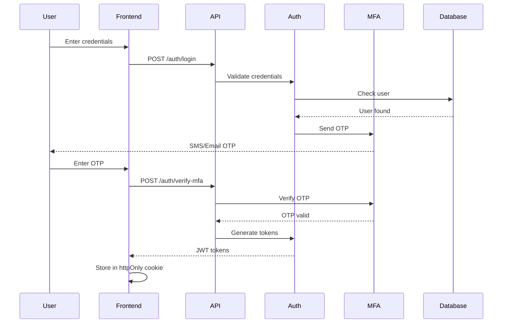
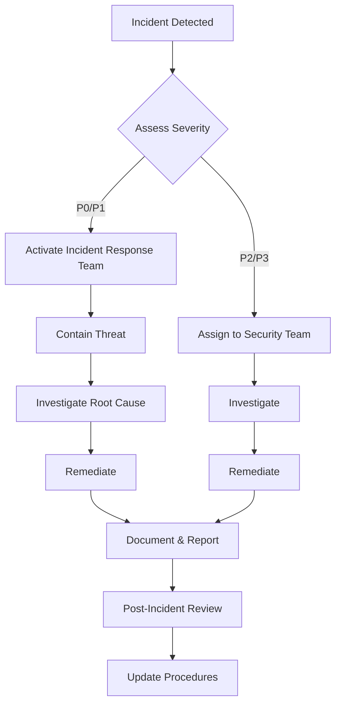

# Security Architecture - Wealth Management CRM

## Table of Contents
- [Overview](#overview)
- [Encryption Standards](#encryption-standards)
- [Authentication & Authorization](#authentication--authorization)
- [RBAC Model](#rbac-model)
- [PII/PCI Data Handling](#piipci-data-handling)
- [Audit Logging](#audit-logging)
- [Incident Response](#incident-response)
- [Penetration Testing](#penetration-testing)
- [SOC 2 Compliance](#soc-2-compliance)
- [Security Checklist](#security-checklist)

## Overview

Security is paramount in a wealth management CRM that handles sensitive financial and personal information. This document outlines the comprehensive security architecture designed to protect client data, ensure regulatory compliance, and maintain system integrity.

### Security Principles
1. **Defense in Depth**: Multiple layers of security controls
2. **Zero Trust**: Never trust, always verify
3. **Least Privilege**: Minimum necessary access
4. **Encryption Everywhere**: Data protected at rest and in transit
5. **Audit Everything**: Complete activity logging
6. **Secure by Default**: Security enabled out-of-the-box
7. **Privacy by Design**: PII protection built into every feature

### Threat Model

**Assets to Protect:**
- Client PII (SSN, DOB, addresses)
- Financial account information
- Investment holdings and positions
- Authentication credentials
- Business secrets and strategies
- Intellectual property

**Threat Actors:**
- External attackers (hackers, nation-states)
- Malicious insiders
- Compromised credentials
- Social engineering attacks
- Supply chain attacks

**Attack Vectors:**
- SQL injection
- Cross-site scripting (XSS)
- Cross-site request forgery (CSRF)
- Man-in-the-middle attacks
- DDoS attacks
- Insider data exfiltration
- Privilege escalation
- Session hijacking

## Encryption Standards

### Data at Rest

**Database Encryption:**
- PostgreSQL with transparent data encryption (TDE)
- Column-level encryption for PII using pgcrypto
- Encryption algorithm: AES-256-GCM
- Separate encryption keys per data classification level

**Encrypted Fields:**
```typescript
// Highly Sensitive (HSM-backed encryption)
- SSN/TIN (tax IDs)
- Account numbers
- Bank routing numbers
- Credit card numbers

// Sensitive (KMS encryption)
- Full names
- Date of birth
- Email addresses
- Phone numbers
- Street addresses
- Employment information

// Internal (application-level encryption)
- Meeting notes with PII
- Communication content
- Document contents
```

**File Storage Encryption:**
- S3 bucket encryption enabled (SSE-KMS)
- Unique KMS key per environment
- Client-side encryption for highly sensitive documents
- Encrypted filename hashing to prevent metadata leakage

**Key Management:**
- AWS KMS for key storage and rotation
- Automatic key rotation every 90 days
- Separate keys per environment (dev, staging, production)
- Keys never stored in application code or configuration
- Hardware Security Module (HSM) for production keys
- Key access audited via CloudTrail

**Backup Encryption:**
- Database backups encrypted with separate KMS key
- Transaction logs encrypted in transit and at rest
- Backup encryption keys stored in separate AWS account

### Data in Transit

**TLS Configuration:**
- TLS 1.3 required for all connections
- TLS 1.2 minimum (1.0/1.1 disabled)
- Perfect Forward Secrecy (PFS) enabled
- Strong cipher suites only:
  - TLS_AES_256_GCM_SHA384
  - TLS_CHACHA20_POLY1305_SHA256
  - TLS_AES_128_GCM_SHA256

**Certificate Management:**
- Certificates from trusted CA (Let's Encrypt or DigiCert)
- Automatic renewal before expiration
- Certificate pinning for mobile applications
- HSTS (HTTP Strict Transport Security) enabled
- Certificate transparency monitoring

**API Security:**
- All API endpoints require HTTPS
- HTTP requests automatically redirected to HTTPS
- API keys transmitted via Authorization header only
- No sensitive data in URL parameters or query strings

**Internal Communication:**
- Service-to-service communication encrypted via TLS
- VPC peering for cross-VPC traffic
- VPN required for database access from outside VPC

### Encryption Key Hierarchy

```
Master Key (HSM)
  ├─ Environment Keys (KMS)
  │   ├─ Production Encryption Key
  │   ├─ Staging Encryption Key
  │   └─ Development Encryption Key
  ├─ Data Encryption Keys (DEK)
  │   ├─ PII Encryption Key
  │   ├─ Financial Data Key
  │   └─ Document Encryption Key
  └─ Backup Keys
      ├─ Database Backup Key
      └─ Archive Storage Key
```

## Authentication & Authorization

### Authentication Flow



### Password Policy

**Requirements:**
- Minimum 12 characters
- Must contain:
  - At least one uppercase letter
  - At least one lowercase letter
  - At least one number
  - At least one special character
- Cannot contain username or email
- Cannot match previous 5 passwords
- Cannot contain common dictionary words
- Cannot be a compromised password (checked against HaveIBeenPwned API)

**Password Storage:**
- Hashed using bcrypt with work factor 12
- Salted automatically by bcrypt
- Never stored in plaintext
- Never logged or transmitted after initial submission
- Password reset tokens expire in 1 hour
- Password reset requires email verification

### Multi-Factor Authentication

**MFA Methods:**
1. **Time-based OTP (TOTP)** - Preferred method
   - Compatible with Google Authenticator, Authy
   - 6-digit codes, 30-second rotation
2. **SMS** - Backup method
   - Sent to verified phone number
   - Rate limited to prevent abuse
3. **Email** - Secondary backup
   - Sent to verified email address
   - Only for account recovery

**MFA Enforcement:**
- Required for all user accounts
- Grace period: 7 days for new users
- Cannot be disabled without compliance approval
- Backup codes provided (10 single-use codes)

### JWT Token Management

**Access Token:**
- Expiration: 1 hour
- Contains: user ID, role, permissions
- Stored in httpOnly cookie (CSRF protection)
- Signed with RS256 (asymmetric)
- Includes jti (JWT ID) for revocation tracking

**Refresh Token:**
- Expiration: 7 days
- Stored in httpOnly cookie
- Rotated on each use
- Revoked on logout or password change
- Limited to 5 active refresh tokens per user

**Token Revocation:**
- Redis-based revocation list
- Tokens revoked on:
  - User logout
  - Password change
  - Permission change
  - Security incident
  - Admin action

### Session Management

**Session Properties:**
- Server-side session storage in Redis
- Session ID in httpOnly, secure, SameSite=Strict cookie
- Session timeout: 12 hours of inactivity
- Absolute timeout: 24 hours
- Concurrent session limit: 3 per user
- IP address binding (optional, configurable)

**Session Security:**
- New session ID generated after login
- Session ID regenerated on privilege escalation
- Sessions invalidated on logout
- Expired sessions automatically cleaned up

## RBAC Model

### Role Hierarchy

```
Super Admin
  ├─ Compliance Officer
  ├─ Lead Advisor
  │   └─ Associate Advisor
  │       └─ Client Service
  ├─ Operations Manager
  │   └─ Operations Specialist
  └─ Read Only
```

### Role Definitions

#### Super Admin
**Description**: Full system access for IT administrators
**Granted To**: Internal IT staff only
**Permissions**:
- All system permissions
- User management (create, update, delete, reset passwords)
- Role assignment
- System configuration
- Access to all households
- Audit log access
- Security settings modification

**Restrictions**:
- Cannot access production without justification
- All actions logged and reviewed monthly
- Requires separate approval for PII access

#### Compliance Officer
**Description**: Oversight and audit access
**Granted To**: Compliance department
**Permissions**:
- Read access to all households
- Read access to all communications
- Export capabilities (with logging)
- Audit log review
- Compliance report generation
- Policy enforcement monitoring
- Investigation access (with approval)

**Restrictions**:
- Cannot modify client data
- Cannot execute trades
- Cannot access system configuration
- All exports logged and reviewed

#### Lead Advisor
**Description**: Primary relationship manager for households
**Granted To**: Financial advisors
**Permissions**:
- Full access to assigned households
- Create/update/delete household members
- Create/update accounts
- Create investment proposals
- Execute trades (if discretionary)
- Upload/download documents
- Log communications
- Create tasks and reminders
- Billing management

**Restrictions**:
- Access limited to assigned households
- Cannot access other advisors' households without permission
- Cannot modify system settings
- Trade execution requires compliance approval for large trades

#### Associate Advisor
**Description**: Supporting advisor role
**Granted To**: Junior advisors, CFP candidates
**Permissions**:
- Read/write access to assigned households
- Create meeting notes
- Upload documents
- Log communications
- Create investment proposals (requires approval)
- View positions and performance

**Restrictions**:
- Cannot execute trades
- Cannot modify account registration
- Cannot update fee schedules
- Proposals require lead advisor approval

#### Client Service
**Description**: Administrative support role
**Granted To**: Client service representatives
**Permissions**:
- Read access to assigned households
- Update contact information
- Log communications
- Upload documents
- Create tasks
- View calendar

**Restrictions**:
- Cannot view financial positions
- Cannot view account numbers
- Cannot modify accounts
- Cannot execute trades
- Cannot view SSN/TIN

#### Operations Manager
**Description**: Back-office operations leader
**Granted To**: Operations department heads
**Permissions**:
- Account opening/closing
- Document management
- Cash movement processing
- Bank account updates
- Registration changes
- Custodian reconciliation
- Operations reports

**Restrictions**:
- Cannot access household relationship information
- Cannot log client communications
- Cannot create investment proposals
- Access limited to operations workflow

#### Operations Specialist
**Description**: Operations team member
**Granted To**: Operations staff
**Permissions**:
- Account opening workflow
- Document processing
- Data entry
- Custodian reconciliation

**Restrictions**:
- Same as Operations Manager
- Cannot approve operations tasks
- Cannot modify critical account data

#### Read Only
**Description**: View-only access for reporting
**Granted To**: Reporting analysts, interns
**Permissions**:
- Read access to assigned households
- View aggregated reports
- Export reports (no PII)

**Restrictions**:
- Cannot modify any data
- Cannot view SSN/TIN
- Cannot view full account numbers
- Cannot export PII

### Permission Matrix

| Permission | Super Admin | Compliance | Lead Advisor | Assoc Advisor | Client Svc | Ops Mgr | Ops Spec | Read Only |
|-----------|-------------|------------|--------------|---------------|------------|---------|----------|-----------|
| View All Households | ✓ | ✓ | - | - | - | - | - | - |
| View Assigned Households | ✓ | ✓ | ✓ | ✓ | ✓ | - | - | ✓ |
| Create Household | ✓ | - | ✓ | - | - | - | - | - |
| Update Household | ✓ | - | ✓ | ✓ | ✓* | - | - | - |
| Delete Household | ✓ | - | - | - | - | - | - | - |
| View Accounts | ✓ | ✓ | ✓ | ✓ | - | ✓ | ✓ | ✓ |
| Create Account | ✓ | - | ✓ | - | - | ✓ | ✓ | - |
| Update Account | ✓ | - | ✓ | - | - | ✓ | - | - |
| Close Account | ✓ | - | ✓ | - | - | ✓ | - | - |
| View Positions | ✓ | ✓ | ✓ | ✓ | - | - | - | ✓ |
| Execute Trade | ✓ | - | ✓** | - | - | - | - | - |
| View Documents | ✓ | ✓ | ✓ | ✓ | ✓ | ✓ | ✓ | - |
| Upload Document | ✓ | - | ✓ | ✓ | ✓ | ✓ | ✓ | - |
| Delete Document | ✓ | - | ✓ | - | - | ✓ | - | - |
| View Communications | ✓ | ✓ | ✓ | ✓ | ✓ | - | - | - |
| Log Communication | ✓ | - | ✓ | ✓ | ✓ | - | - | - |
| View Audit Logs | ✓ | ✓ | - | - | - | - | - | - |
| Export Data | ✓ | ✓*** | ✓*** | - | - | - | - | - |
| Manage Users | ✓ | - | - | - | - | - | - | - |
| System Config | ✓ | - | - | - | - | - | - | - |

\* Limited to contact information only  
\*\* Requires discretionary authority  
\*\*\* All exports logged and monitored

### Resource-Level Authorization

Authorization enforced at multiple levels:
1. **API Gateway**: JWT validation, rate limiting
2. **Controller**: Role-based route protection
3. **Service**: Business logic authorization
4. **Database**: Row-level security policies

**Example RLS Policy (PostgreSQL):**
```sql
-- Lead Advisor can only access assigned households
CREATE POLICY advisor_household_access ON households
  FOR ALL
  TO advisor_role
  USING (
    id IN (
      SELECT household_id 
      FROM household_advisors 
      WHERE user_id = current_user_id()
    )
  );
```

## PII/PCI Data Handling

### PII Classification

**Level 1 - Highly Sensitive:**
- Social Security Number (SSN)
- Tax ID Number (TIN)
- Account numbers
- Credit card numbers
- Bank routing numbers
- Medical information
- Biometric data

**Level 2 - Sensitive:**
- Full name
- Date of birth
- Home address
- Personal email
- Personal phone number
- Driver's license number
- Passport number

**Level 3 - Internal:**
- Household notes
- Meeting notes
- Investment preferences
- Risk tolerance

### PII Protection Mechanisms

**Encryption:**
- All PII encrypted at rest using AES-256-GCM
- Separate encryption keys per PII level
- Field-level encryption in database

**Masking:**
- SSN displayed as XXX-XX-1234
- Account numbers show last 4 digits only
- Full display requires explicit permission
- Unmask action logged to audit trail

**Access Control:**
- PII access requires specific permission
- All PII access logged
- Quarterly access reviews
- Automatic alerts for unusual access patterns

**Data Minimization:**
- Collect only necessary PII
- Prompt for deletion of unnecessary data
- Automatic archival of old records

### PCI DSS Compliance

While this system doesn't process credit card payments directly, we follow PCI DSS principles:

**Requirements Met:**
- Encryption of cardholder data at rest
- Encryption of data in transit (TLS 1.3)
- Access control measures
- Network segmentation
- Regular security testing
- Information security policy

**Scope:**
- No credit card processing in application
- Payment processing via PCI-compliant third party (Stripe, etc.)
- No storage of CVV codes
- Tokenization for stored payment methods

### Data Subject Rights (GDPR/CCPA)

**Right to Access:**
- API endpoint for data export
- PDF summary of all personal data
- Delivered within 30 days

**Right to Deletion:**
- Soft delete with 30-day grace period
- Hard delete after retention period
- Exceptions for legal requirements

**Right to Rectification:**
- Self-service profile updates
- Request form for other data

**Right to Data Portability:**
- JSON export of all personal data
- Standard format for easy import

## Audit Logging

### Audit Event Types

**Security Events:**
- Login (success/failure)
- Logout
- MFA verification (success/failure)
- Password change
- Password reset request
- Permission change
- Role assignment
- Account lockout
- Session timeout
- Token refresh

**Data Access Events:**
- PII field access (SSN view, etc.)
- Document download
- Report generation
- Data export
- Bulk operations
- Search queries

**Data Modification Events:**
- Create operations (household, account, person)
- Update operations (with before/after values)
- Delete operations (soft delete flag)
- Bulk updates
- Import operations

**System Events:**
- Configuration changes
- User creation/deletion
- System errors
- API rate limit exceeded
- Failed authorization attempts
- Database migrations

### Audit Log Format

```json
{
  "id": "uuid",
  "timestamp": "2024-12-22T10:30:00Z",
  "event_type": "PII_ACCESS",
  "severity": "INFO",
  "user_id": "user-uuid",
  "user_email": "advisor@firm.com",
  "user_role": "LEAD_ADVISOR",
  "ip_address": "192.168.1.100",
  "user_agent": "Mozilla/5.0...",
  "resource_type": "person",
  "resource_id": "person-uuid",
  "action": "VIEW_SSN",
  "result": "SUCCESS",
  "changes": {
    "field": "ssn",
    "action": "view_full"
  },
  "metadata": {
    "household_id": "household-uuid",
    "session_id": "session-uuid",
    "request_id": "request-uuid"
  }
}
```

### Audit Log Storage

**Database:**
- PostgreSQL table partitioned by month
- Separate tablespace for audit data
- Replicated to read replica
- 7-year retention in primary database

**Long-term Archive:**
- Logs older than 2 years moved to S3
- Compressed and encrypted
- Glacier Deep Archive for cost savings
- Retained for 10 years minimum

**Real-time Monitoring:**
- Critical events streamed to SIEM (DataDog, Splunk)
- Automated alerts for suspicious activity
- Dashboard for compliance review

### Audit Log Protection

**Immutability:**
- Append-only table (no UPDATE or DELETE)
- Database triggers prevent modification
- Blockchain-style hashing for integrity verification
- Regular integrity checks

**Access Control:**
- Only Super Admin and Compliance Officer can view
- Audit log access itself is audited
- No programmatic deletion (manual DBA process only)

**Backup:**
- Hourly backups to separate account
- Cross-region replication
- 30-day point-in-time recovery

## Incident Response

### Incident Categories

**Severity Levels:**
- **P0 - Critical**: Active breach, data exfiltration, complete system outage
- **P1 - High**: Potential breach, vulnerability discovered, partial outage
- **P2 - Medium**: Security policy violation, failed penetration test finding
- **P3 - Low**: Minor configuration issue, compliance finding

### Incident Response Process



### Incident Response Team

**Core Team:**
- **Incident Commander**: CTO or VP Engineering
- **Security Lead**: CISO or Security Engineer
- **Communications**: Legal counsel + CEO
- **Technical**: Lead developers, DevOps

**Extended Team:**
- Legal counsel
- Compliance officer
- Third-party forensics (if needed)
- Law enforcement (if criminal activity)

### Response Procedures

**Detection Phase:**
1. Alert triggered by SIEM or manual report
2. Security team acknowledges alert
3. Initial assessment within 15 minutes
4. Severity classification

**Containment Phase (P0/P1):**
1. Isolate affected systems
2. Preserve evidence (logs, memory dumps)
3. Revoke compromised credentials
4. Enable additional monitoring
5. Notify incident response team

**Investigation Phase:**
1. Analyze logs and forensic evidence
2. Identify attack vector
3. Determine scope of compromise
4. Identify affected data/users
5. Document timeline

**Remediation Phase:**
1. Remove attacker access
2. Patch vulnerabilities
3. Reset compromised credentials
4. Restore from clean backups (if needed)
5. Implement additional controls

**Recovery Phase:**
1. Gradual service restoration
2. Enhanced monitoring
3. Validation of security controls
4. Communication to affected parties

**Post-Incident Phase:**
1. Complete incident report
2. Root cause analysis
3. Lessons learned meeting
4. Process improvements
5. Security control updates

### Breach Notification

**Legal Requirements:**
- **SEC**: Report within 24 hours if material impact
- **State Laws**: Vary by state (California: 30 days, etc.)
- **GDPR**: 72 hours if EU residents affected

**Notification Process:**
1. Legal counsel approval
2. Client notification via email and mail
3. Regulatory notification as required
4. Public disclosure if material
5. Credit monitoring offered (if SSN compromised)

### Incident Communication Plan

**Internal:**
- Incident response team via Slack/PagerDuty
- Executive team briefing (P0/P1)
- All-hands if company-wide impact

**External:**
- Client notification (template pre-approved)
- Regulatory notification
- PR statement (if public)
- Law enforcement (if criminal)

## Penetration Testing

### Testing Scope

**Annual Testing (Required):**
- External penetration test (public-facing systems)
- Internal penetration test (from inside network)
- Web application testing (OWASP Top 10)
- Mobile application testing
- Social engineering assessment
- Wireless network testing

**Quarterly Testing:**
- Automated vulnerability scanning
- Web application scanning
- API security testing
- Configuration reviews

**Continuous Testing:**
- Automated security scanning in CI/CD
- Dependency vulnerability scanning
- Static code analysis (SAST)
- Dynamic application security testing (DAST)

### Testing Methodology

**OWASP Top 10 Coverage:**
1. Broken Access Control
2. Cryptographic Failures
3. Injection
4. Insecure Design
5. Security Misconfiguration
6. Vulnerable and Outdated Components
7. Identification and Authentication Failures
8. Software and Data Integrity Failures
9. Security Logging and Monitoring Failures
10. Server-Side Request Forgery (SSRF)

**Test Approaches:**
- **Black Box**: No internal knowledge (external attacker perspective)
- **Gray Box**: Limited knowledge (compromised user perspective)
- **White Box**: Full knowledge (thorough code review)

### Remediation Process

**Severity Classification:**
- **Critical**: Remote code execution, SQL injection, authentication bypass
- **High**: XSS, CSRF, privilege escalation
- **Medium**: Information disclosure, weak encryption
- **Low**: Missing security headers, verbose errors

**Remediation Timelines:**
- Critical: 24 hours
- High: 7 days
- Medium: 30 days
- Low: 90 days

**Verification:**
- Retest after remediation
- Quarterly validation
- Penetration test company provides retest

### Approved Testing Vendors

- **Primary**: [TBD - select reputable firm like Coalfire, Bishop Fox, NCC Group]
- **Secondary**: [TBD - backup vendor]
- **Bug Bounty**: Consider HackerOne or Bugcrowd program

## SOC 2 Compliance

### SOC 2 Trust Service Criteria

**Security (Required):**
- The system is protected against unauthorized access

**Availability:**
- The system is available for operation as committed

**Processing Integrity:**
- System processing is complete, valid, accurate, timely, and authorized

**Confidentiality:**
- Information designated as confidential is protected

**Privacy:**
- Personal information is collected, used, retained, disclosed, and disposed of properly

### Control Implementation

**Security Controls:**
- Multi-factor authentication
- Encryption at rest and in transit
- Role-based access control
- Intrusion detection/prevention
- Vulnerability management
- Incident response procedures

**Availability Controls:**
- Multi-AZ deployment
- Automated failover
- 99.9% uptime SLA
- Disaster recovery plan
- Regular backup testing

**Processing Integrity:**
- Input validation
- Error handling
- Transaction logging
- Reconciliation procedures
- Data quality checks

**Confidentiality Controls:**
- Data classification
- Encryption
- Access controls
- Non-disclosure agreements
- Secure disposal procedures

**Privacy Controls:**
- Privacy policy
- Consent management
- Data subject rights
- Data retention policies
- Third-party oversight

### Audit Preparation

**Documentation Required:**
- Security policies and procedures
- Access control matrices
- Change management logs
- Incident response records
- Vendor management documentation
- Employee background checks
- Security training records
- Penetration test reports
- Disaster recovery test results

**Continuous Monitoring:**
- Automated control testing
- Monthly security reviews
- Quarterly compliance reports
- Annual SOC 2 audit

## Security Checklist

### Pre-Production Security Review

**Authentication & Authorization:**
- [ ] MFA enabled and enforced
- [ ] Password policy implemented
- [ ] JWT tokens configured properly
- [ ] Session management secure
- [ ] RBAC implemented and tested
- [ ] API authentication required

**Data Protection:**
- [ ] PII encrypted at rest
- [ ] Sensitive data encrypted in transit
- [ ] TLS 1.3 configured
- [ ] Database encryption enabled
- [ ] S3 bucket encryption enabled
- [ ] Key rotation configured

**Application Security:**
- [ ] Input validation on all endpoints
- [ ] SQL injection prevention (parameterized queries)
- [ ] XSS prevention (output encoding)
- [ ] CSRF protection enabled
- [ ] Rate limiting configured
- [ ] Security headers configured (CSP, HSTS, etc.)
- [ ] Error handling doesn't leak sensitive info
- [ ] Dependencies scanned for vulnerabilities
- [ ] OWASP Top 10 addressed

**Infrastructure Security:**
- [ ] Network segmentation implemented
- [ ] Security groups configured (least privilege)
- [ ] Bastion host for admin access
- [ ] VPN required for sensitive access
- [ ] CloudTrail enabled
- [ ] GuardDuty enabled
- [ ] AWS Config rules implemented

**Monitoring & Logging:**
- [ ] Audit logging enabled
- [ ] SIEM integration configured
- [ ] Alerting for security events
- [ ] Log retention configured
- [ ] Log integrity protection enabled

**Compliance:**
- [ ] SOC 2 controls documented
- [ ] SEC requirements mapped
- [ ] Privacy policy published
- [ ] Terms of service published
- [ ] Data retention policies implemented
- [ ] Incident response plan documented

**Testing:**
- [ ] Penetration test completed
- [ ] Vulnerability scan completed
- [ ] Security code review completed
- [ ] Automated security scanning in CI/CD

### Monthly Security Review

- [ ] Review access logs for anomalies
- [ ] Review user permissions (least privilege)
- [ ] Check for unused accounts
- [ ] Review failed authentication attempts
- [ ] Check for security patches
- [ ] Review incident reports
- [ ] Verify backup integrity
- [ ] Test disaster recovery procedures

### Quarterly Security Tasks

- [ ] Access control review
- [ ] Penetration testing
- [ ] Security training for staff
- [ ] Policy and procedure review
- [ ] Vendor security assessment
- [ ] Compliance gap analysis
- [ ] Security metrics review

### Annual Security Tasks

- [ ] Full penetration test
- [ ] SOC 2 audit
- [ ] Disaster recovery drill
- [ ] Policy comprehensive review
- [ ] Security awareness training (all staff)
- [ ] Third-party security assessments
- [ ] Cyber insurance review

---

**Document Version**: 1.0  
**Last Updated**: 2024-12-22  
**Owner**: Security Team  
**Review Cycle**: Quarterly  
**Next Review**: 2025-03-22
