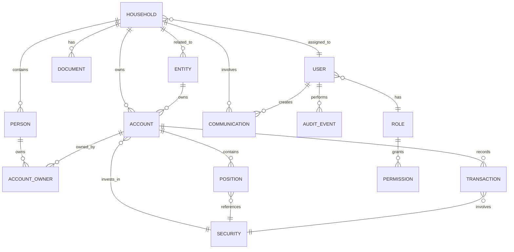
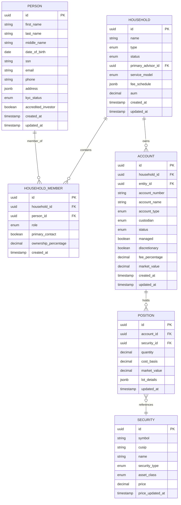
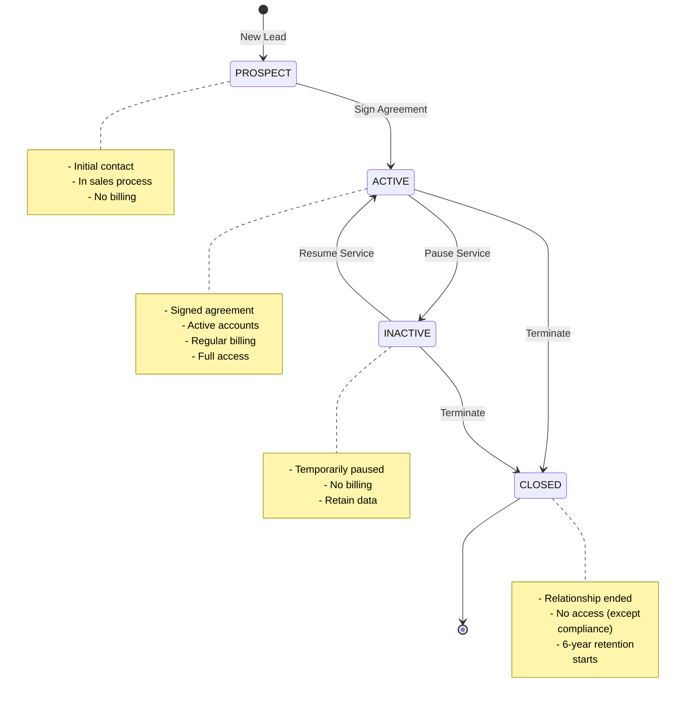
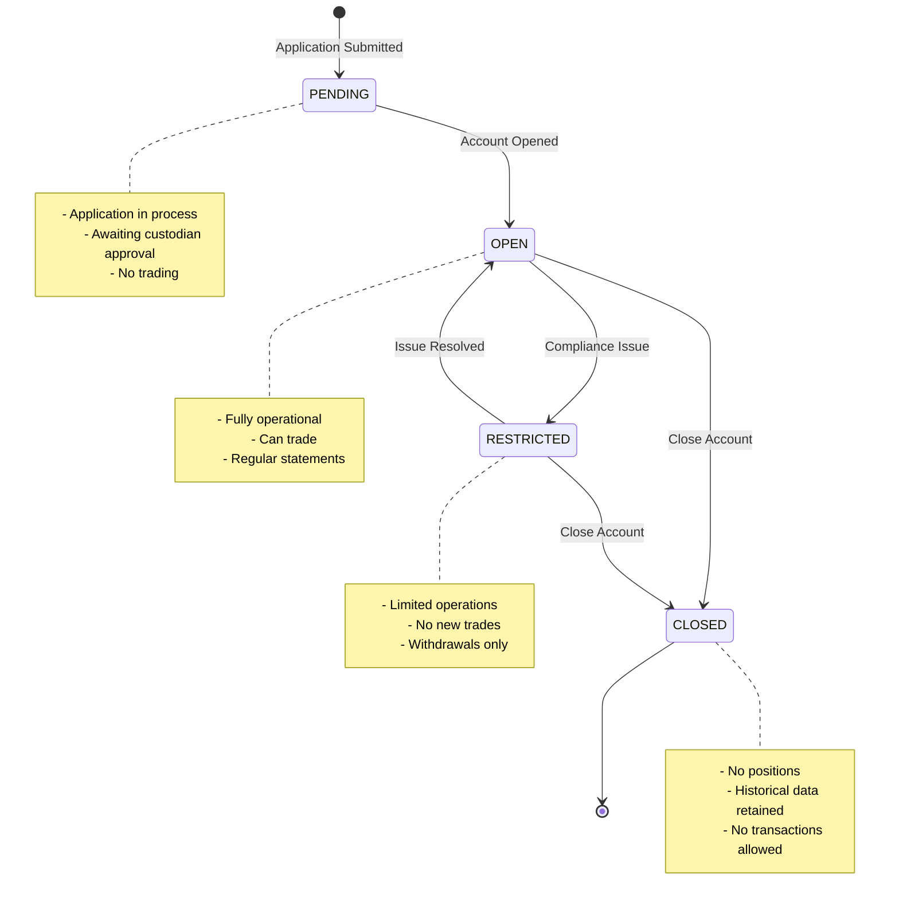
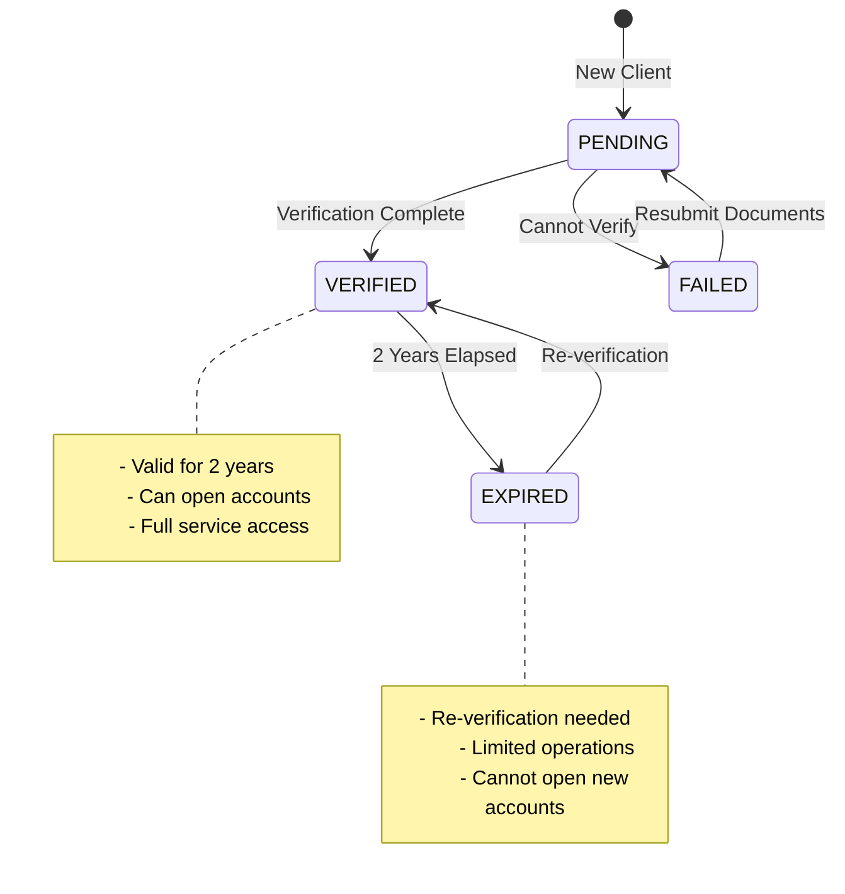
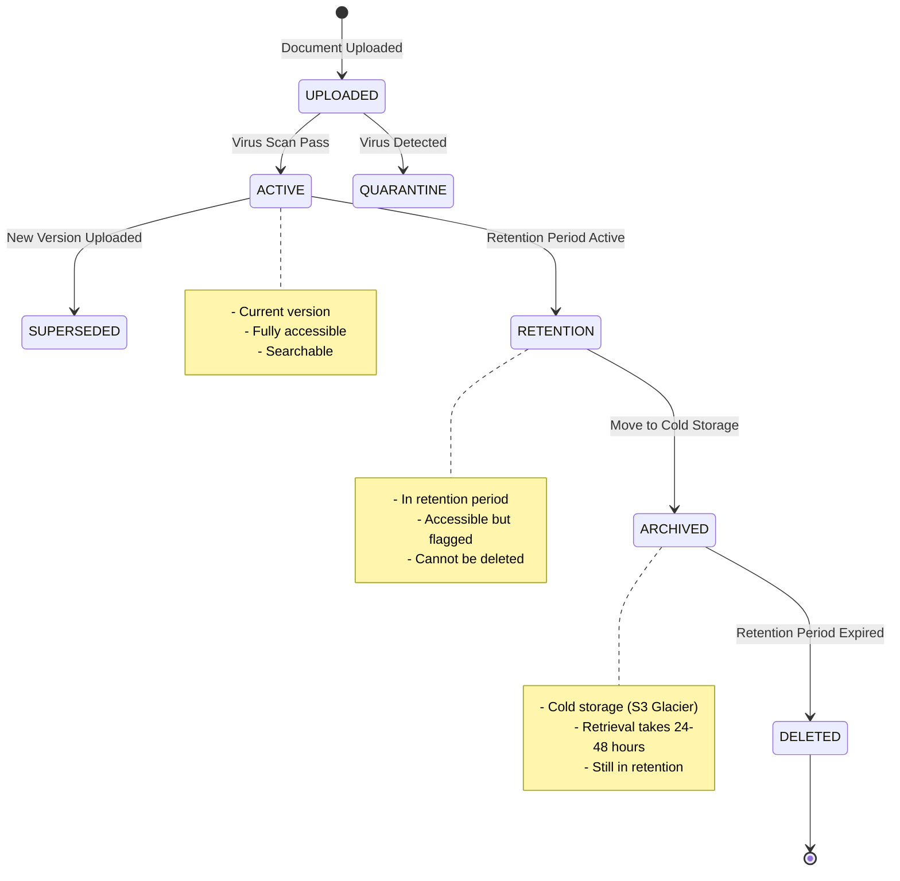

# Domain Model - Wealth Management CRM

## Table of Contents
- [Overview](#overview)
- [Entity Relationship Diagram](#entity-relationship-diagram)
- [Core Entities](#core-entities)
- [Relationship Cardinalities](#relationship-cardinalities)
- [Business Rules and Constraints](#business-rules-and-constraints)
- [Validation Requirements](#validation-requirements)
- [Lifecycle States](#lifecycle-states)

## Overview

The domain model represents the core business entities and their relationships in the wealth management CRM. This model is designed to support complex household structures, multi-custodian account management, investment tracking, and comprehensive compliance requirements.

### Design Principles
1. **Rich Domain Model**: Business logic embedded in entities
2. **Aggregate Roots**: Household and Account are primary aggregates
3. **Value Objects**: Money, Address, Contact Info as immutable value objects
4. **Bounded Contexts**: Clear separation between client management, investment management, and compliance
5. **Event Sourcing**: Critical state changes captured as domain events

## Entity Relationship Diagram

### High-Level ERD


### Detailed Relationships


## Core Entities

### 1. Household

**Purpose**: Primary organizational unit representing a family, individual, or group of related entities.

**Fields:**

| Field | Type | Required | Encrypted | Description |
|-------|------|----------|-----------|-------------|
| id | UUID | Yes | No | Unique identifier |
| name | VARCHAR(200) | Yes | No | Display name (e.g., "Smith Family") |
| type | ENUM | Yes | No | FAMILY, INDIVIDUAL, TRUST, FOUNDATION, CORPORATION |
| status | ENUM | Yes | No | PROSPECT, ACTIVE, INACTIVE, CLOSED |
| primary_advisor_id | UUID | Yes | No | FK to users table |
| secondary_advisor_id | UUID | No | No | FK to users table (optional backup advisor) |
| service_model | ENUM | Yes | No | WEALTH_MANAGEMENT, FINANCIAL_PLANNING, INVESTMENT_ONLY, CONSULTING |
| fee_schedule | JSONB | Yes | No | Custom fee arrangements and tiers |
| aum | DECIMAL(15,2) | No | No | Calculated from account positions |
| aum_as_of | TIMESTAMP | No | No | When AUM was last calculated |
| billing_frequency | ENUM | Yes | No | QUARTERLY, MONTHLY, ANNUAL |
| billing_method | ENUM | Yes | No | ARREARS, ADVANCE |
| onboarding_date | DATE | No | No | When client relationship began |
| termination_date | DATE | No | No | When client relationship ended |
| termination_reason | TEXT | No | No | Reason for termination |
| risk_tolerance | ENUM | No | No | CONSERVATIVE, MODERATE, GROWTH, AGGRESSIVE |
| investment_objective | ENUM | No | No | PRESERVATION, INCOME, GROWTH, SPECULATION |
| notes | TEXT | No | No | Internal notes about household |
| created_at | TIMESTAMP | Yes | No | Record creation timestamp |
| updated_at | TIMESTAMP | Yes | No | Last update timestamp |
| created_by | UUID | Yes | No | User who created record |
| updated_by | UUID | Yes | No | User who last updated record |

**Indexes:**
- PRIMARY KEY (id)
- INDEX idx_household_status (status)
- INDEX idx_household_primary_advisor (primary_advisor_id)
- INDEX idx_household_name (name) USING gin (name gin_trgm_ops)
- INDEX idx_household_created (created_at)

**Constraints:**
- CHECK (aum >= 0)
- CHECK (onboarding_date <= CURRENT_DATE)
- CHECK (termination_date IS NULL OR termination_date >= onboarding_date)
- CHECK (status = 'CLOSED' OR termination_date IS NULL)

### 2. Person

**Purpose**: Represents an individual human being with comprehensive PII protection.

**Fields:**

| Field | Type | Required | Encrypted | Description |
|-------|------|----------|-----------|-------------|
| id | UUID | Yes | No | Unique identifier |
| first_name | VARCHAR(100) | Yes | Yes | Encrypted PII |
| last_name | VARCHAR(100) | Yes | Yes | Encrypted PII |
| middle_name | VARCHAR(100) | No | Yes | Encrypted PII |
| suffix | VARCHAR(20) | No | No | Jr., Sr., III, etc. |
| preferred_name | VARCHAR(100) | No | No | Nickname or preferred first name |
| date_of_birth | DATE | Yes | Yes | Encrypted PII |
| ssn | VARCHAR(11) | No | Yes | Encrypted, format: XXX-XX-XXXX |
| citizenship | VARCHAR(2) | No | No | ISO country code |
| country_of_birth | VARCHAR(2) | No | No | ISO country code |
| marital_status | ENUM | No | No | SINGLE, MARRIED, DIVORCED, WIDOWED, PARTNERED |
| employment_status | VARCHAR(100) | No | No | Current employment status |
| employer | VARCHAR(200) | No | No | Current or last employer |
| occupation | VARCHAR(100) | No | No | Job title or profession |
| tax_filing_status | ENUM | No | No | SINGLE, MARRIED_JOINT, MARRIED_SEPARATE, HEAD_OF_HOUSEHOLD |
| email | VARCHAR(255) | No | Yes | Primary email (encrypted) |
| email_verified | BOOLEAN | Yes | No | Email verification status |
| phone_primary | VARCHAR(20) | No | Yes | Primary phone (encrypted) |
| phone_secondary | VARCHAR(20) | No | Yes | Secondary phone (encrypted) |
| address_line1 | VARCHAR(255) | No | Yes | Street address |
| address_line2 | VARCHAR(255) | No | Yes | Apt, suite, etc. |
| city | VARCHAR(100) | No | Yes | City |
| state | VARCHAR(2) | No | No | State code |
| postal_code | VARCHAR(20) | No | Yes | ZIP or postal code |
| country | VARCHAR(2) | No | No | ISO country code |
| kyc_status | ENUM | Yes | No | PENDING, VERIFIED, EXPIRED, FAILED |
| kyc_verified_date | DATE | No | No | When KYC was completed |
| kyc_verified_by | UUID | No | No | User who verified KYC |
| kyc_expiration_date | DATE | No | No | When KYC reverification needed |
| accredited_investor | BOOLEAN | Yes | No | SEC accredited investor status |
| accredited_basis | ENUM | No | No | INCOME, NET_WORTH, LICENSED, ENTITY |
| accredited_verified_date | DATE | No | No | Accreditation verification date |
| qualified_client | BOOLEAN | Yes | No | SEC qualified client status (>$1.1M AUM) |
| qualified_purchaser | BOOLEAN | Yes | No | SEC qualified purchaser ($5M+ investments) |
| pep_status | BOOLEAN | Yes | No | Politically Exposed Person |
| ofac_checked | BOOLEAN | Yes | No | OFAC sanctions list checked |
| ofac_checked_date | TIMESTAMP | No | No | Last OFAC check |
| annual_income | DECIMAL(12,2) | No | Yes | Encrypted financial info |
| net_worth | DECIMAL(15,2) | No | Yes | Excluding primary residence |
| liquid_net_worth | DECIMAL(15,2) | No | Yes | Readily available assets |
| created_at | TIMESTAMP | Yes | No | Record creation |
| updated_at | TIMESTAMP | Yes | No | Last update |
| created_by | UUID | Yes | No | Creating user |
| updated_by | UUID | Yes | No | Last updating user |

**Indexes:**
- PRIMARY KEY (id)
- UNIQUE INDEX idx_person_ssn (ssn) WHERE ssn IS NOT NULL
- INDEX idx_person_email (email)
- INDEX idx_person_kyc_status (kyc_status)
- INDEX idx_person_last_name (last_name)

**Constraints:**
- CHECK (date_of_birth <= CURRENT_DATE - INTERVAL '18 years')
- CHECK (kyc_expiration_date IS NULL OR kyc_expiration_date > kyc_verified_date)
- CHECK (email ~* '^[A-Za-z0-9._%+-]+@[A-Za-z0-9.-]+\.[A-Z|a-z]{2,}$')

### 3. Household_Member

**Purpose**: Junction table linking persons to households with role information.

**Fields:**

| Field | Type | Required | Description |
|-------|------|----------|-------------|
| id | UUID | Yes | Unique identifier |
| household_id | UUID | Yes | FK to households |
| person_id | UUID | Yes | FK to persons |
| role | ENUM | Yes | CLIENT, SPOUSE, PARTNER, DEPENDENT, BENEFICIARY, TRUSTEE, POWER_OF_ATTORNEY, OTHER |
| primary_contact | BOOLEAN | Yes | Is this the primary contact? |
| ownership_percentage | DECIMAL(5,2) | No | Ownership stake in household assets |
| relationship_to_primary | VARCHAR(100) | No | Relationship description |
| can_trade | BOOLEAN | Yes | Trading authority |
| can_withdraw | BOOLEAN | Yes | Withdrawal authority |
| receives_statements | BOOLEAN | Yes | Should receive account statements |
| receives_tax_docs | BOOLEAN | Yes | Should receive tax documents |
| active | BOOLEAN | Yes | Currently active member |
| start_date | DATE | Yes | When relationship began |
| end_date | DATE | No | When relationship ended |
| notes | TEXT | No | Additional information |
| created_at | TIMESTAMP | Yes | Record creation |
| updated_at | TIMESTAMP | Yes | Last update |

**Indexes:**
- PRIMARY KEY (id)
- UNIQUE INDEX idx_household_person (household_id, person_id, active) WHERE active = true
- INDEX idx_household_members (household_id)
- INDEX idx_person_households (person_id)

**Constraints:**
- CHECK (ownership_percentage >= 0 AND ownership_percentage <= 100)
- CHECK (end_date IS NULL OR end_date >= start_date)
- FOREIGN KEY (household_id) REFERENCES households(id)
- FOREIGN KEY (person_id) REFERENCES persons(id)

### 4. Entity

**Purpose**: Legal entities such as trusts, LLCs, foundations, corporations.

**Fields:**

| Field | Type | Required | Encrypted | Description |
|-------|------|----------|-----------|-------------|
| id | UUID | Yes | No | Unique identifier |
| name | VARCHAR(255) | Yes | No | Legal name of entity |
| short_name | VARCHAR(100) | No | No | Display name |
| type | ENUM | Yes | No | TRUST, LLC, CORPORATION, PARTNERSHIP, FOUNDATION, ESTATE, FAMILY_LIMITED_PARTNERSHIP |
| sub_type | VARCHAR(100) | No | No | Specific type (e.g., "Revocable Living Trust") |
| tax_id | VARCHAR(20) | No | Yes | EIN or other tax ID (encrypted) |
| state_of_formation | VARCHAR(2) | No | No | State code |
| country_of_formation | VARCHAR(2) | Yes | No | ISO country code |
| formation_date | DATE | No | No | When entity was formed |
| dissolution_date | DATE | No | No | When entity was dissolved |
| status | ENUM | Yes | No | ACTIVE, DISSOLVED, PENDING, SUSPENDED |
| trustees | JSONB | No | No | Array of trustee information (for trusts) |
| beneficiaries | JSONB | No | No | Beneficiary information |
| members | JSONB | No | No | Member information (for LLCs) |
| officers | JSONB | No | No | Officers (for corporations) |
| registered_agent | VARCHAR(255) | No | No | Registered agent name |
| registered_agent_address | JSONB | No | No | Agent address |
| annual_revenue | DECIMAL(15,2) | No | Yes | For business entities |
| number_of_employees | INTEGER | No | No | For business entities |
| description | TEXT | No | No | Purpose and description |
| notes | TEXT | No | No | Internal notes |
| created_at | TIMESTAMP | Yes | No | Record creation |
| updated_at | TIMESTAMP | Yes | No | Last update |
| created_by | UUID | Yes | No | Creating user |
| updated_by | UUID | Yes | No | Last updating user |

**Indexes:**
- PRIMARY KEY (id)
- INDEX idx_entity_type (type)
- INDEX idx_entity_status (status)
- INDEX idx_entity_name (name) USING gin (name gin_trgm_ops)

**Constraints:**
- CHECK (dissolution_date IS NULL OR dissolution_date >= formation_date)
- CHECK (status = 'DISSOLVED' OR dissolution_date IS NULL)

### 5. Account

**Purpose**: Financial accounts held at custodians (brokerage, retirement, banking).

**Fields:**

| Field | Type | Required | Encrypted | Description |
|-------|------|----------|-----------|-------------|
| id | UUID | Yes | No | Unique identifier |
| household_id | UUID | Yes | No | FK to households |
| entity_id | UUID | No | No | FK to entities (if entity-owned) |
| account_number | VARCHAR(50) | Yes | Yes | Encrypted account number |
| account_number_last_four | VARCHAR(4) | Yes | No | Last 4 digits (for display) |
| account_name | VARCHAR(255) | Yes | No | Display name |
| account_type | ENUM | Yes | No | BROKERAGE, IRA_TRADITIONAL, IRA_ROTH, 401K, 403B, SEP_IRA, SIMPLE_IRA, 529, TRUST, JOINT, INDIVIDUAL, BANKING, etc. |
| registration | TEXT | Yes | No | Legal account registration |
| custodian | ENUM | Yes | No | SCHWAB, FIDELITY, PERSHING, INTERACTIVEBROKERS, VANGUARD, TDAMERITRADE, OTHER |
| custodian_account_id | VARCHAR(100) | No | No | Custodian's internal ID |
| status | ENUM | Yes | No | PENDING, OPEN, CLOSED, RESTRICTED, FROZEN |
| opened_date | DATE | Yes | No | Account opening date |
| closed_date | DATE | No | No | Account closing date |
| closure_reason | TEXT | No | No | Why account was closed |
| managed | BOOLEAN | Yes | No | Is this a managed account? |
| discretionary | BOOLEAN | Yes | No | Do we have discretionary authority? |
| billing_eligible | BOOLEAN | Yes | No | Include in fee billing? |
| billing_method | ENUM | No | No | DEBIT, INVOICE, EXTERNAL |
| fee_percentage | DECIMAL(6,4) | No | No | Annual fee rate (e.g., 0.0100 = 1.00%) |
| fee_schedule | JSONB | No | No | Tiered fee schedule |
| performance_fee | BOOLEAN | Yes | No | Subject to performance fees? |
| minimum_fee | DECIMAL(10,2) | No | No | Minimum quarterly fee |
| market_value | DECIMAL(15,2) | Yes | No | Current market value |
| cash_balance | DECIMAL(15,2) | Yes | No | Current cash balance |
| accrued_income | DECIMAL(12,2) | Yes | No | Accrued interest/dividends |
| market_value_as_of | DATE | Yes | No | Valuation date |
| cost_basis | DECIMAL(15,2) | No | No | Total cost basis |
| unrealized_gain_loss | DECIMAL(15,2) | No | No | Calculated unrealized G/L |
| ytd_realized_gain_loss | DECIMAL(15,2) | No | No | Year-to-date realized G/L |
| tax_cost_method | ENUM | No | No | FIFO, LIFO, SPECIFIC_ID, AVERAGE_COST |
| benchmark | VARCHAR(50) | No | No | Performance benchmark (e.g., "SPY") |
| model_portfolio | VARCHAR(100) | No | No | Target model portfolio name |
| rebalance_threshold | DECIMAL(5,2) | No | No | Rebalancing trigger (percentage) |
| last_rebalanced_date | DATE | No | No | Last rebalancing date |
| next_review_date | DATE | No | No | Next scheduled review |
| notes | TEXT | No | No | Internal notes |
| external_data | JSONB | No | No | Data from custodian feed |
| created_at | TIMESTAMP | Yes | No | Record creation |
| updated_at | TIMESTAMP | Yes | No | Last update |
| created_by | UUID | Yes | No | Creating user |
| updated_by | UUID | Yes | No | Last updating user |

**Indexes:**
- PRIMARY KEY (id)
- UNIQUE INDEX idx_account_number (custodian, account_number)
- INDEX idx_account_household (household_id)
- INDEX idx_account_entity (entity_id)
- INDEX idx_account_status (status)
- INDEX idx_account_custodian (custodian)

**Constraints:**
- CHECK (market_value >= 0)
- CHECK (closed_date IS NULL OR closed_date >= opened_date)
- CHECK (status = 'CLOSED' OR closed_date IS NULL)
- CHECK (fee_percentage IS NULL OR (fee_percentage >= 0 AND fee_percentage <= 1))
- FOREIGN KEY (household_id) REFERENCES households(id)
- FOREIGN KEY (entity_id) REFERENCES entities(id)

### 6. Account_Owner

**Purpose**: Junction table for account ownership by persons (supports joint accounts).

**Fields:**

| Field | Type | Required | Description |
|-------|------|----------|-------------|
| id | UUID | Yes | Unique identifier |
| account_id | UUID | Yes | FK to accounts |
| person_id | UUID | Yes | FK to persons |
| ownership_type | ENUM | Yes | PRIMARY, JOINT, BENEFICIARY, CUSTODIAN, TRUSTEE, POWER_OF_ATTORNEY |
| ownership_percentage | DECIMAL(5,2) | Yes | Ownership stake (0-100) |
| can_trade | BOOLEAN | Yes | Trading authority |
| can_withdraw | BOOLEAN | Yes | Withdrawal authority |
| receives_statements | BOOLEAN | Yes | Gets account statements |
| start_date | DATE | Yes | Ownership start date |
| end_date | DATE | No | Ownership end date |
| created_at | TIMESTAMP | Yes | Record creation |

**Indexes:**
- PRIMARY KEY (id)
- INDEX idx_account_owners (account_id)
- INDEX idx_person_accounts (person_id)

**Constraints:**
- CHECK (ownership_percentage >= 0 AND ownership_percentage <= 100)
- FOREIGN KEY (account_id) REFERENCES accounts(id)
- FOREIGN KEY (person_id) REFERENCES persons(id)

### 7. Position

**Purpose**: Current holdings/positions in an account.

**Fields:**

| Field | Type | Required | Description |
|-------|------|----------|-------------|
| id | UUID | Yes | Unique identifier |
| account_id | UUID | Yes | FK to accounts |
| security_id | UUID | Yes | FK to securities |
| quantity | DECIMAL(18,6) | Yes | Number of shares/units |
| cost_basis | DECIMAL(15,2) | Yes | Total cost basis |
| average_cost | DECIMAL(12,6) | Yes | Cost per share |
| market_value | DECIMAL(15,2) | Yes | Current market value |
| price | DECIMAL(12,6) | Yes | Current price per share |
| price_as_of | TIMESTAMP | Yes | Price timestamp |
| unrealized_gain_loss | DECIMAL(15,2) | Yes | Calculated unrealized G/L |
| unrealized_gain_loss_percent | DECIMAL(8,4) | Yes | G/L as percentage |
| accrued_income | DECIMAL(12,2) | No | Accrued interest/dividends |
| lot_details | JSONB | No | Tax lot information |
| allocation_percentage | DECIMAL(5,2) | No | Percentage of account |
| target_percentage | DECIMAL(5,2) | No | Target allocation |
| drift_percentage | DECIMAL(6,2) | No | Drift from target |
| updated_at | TIMESTAMP | Yes | Last update |

**Indexes:**
- PRIMARY KEY (id)
- UNIQUE INDEX idx_account_security (account_id, security_id)
- INDEX idx_position_account (account_id)
- INDEX idx_position_security (security_id)

**Constraints:**
- CHECK (quantity >= 0)
- CHECK (market_value >= 0)
- FOREIGN KEY (account_id) REFERENCES accounts(id)
- FOREIGN KEY (security_id) REFERENCES securities(id)

### 8. Security

**Purpose**: Investment securities (stocks, bonds, ETFs, mutual funds, etc.).

**Fields:**

| Field | Type | Required | Description |
|-------|------|----------|-------------|
| id | UUID | Yes | Unique identifier |
| symbol | VARCHAR(20) | No | Ticker symbol |
| cusip | VARCHAR(9) | No | CUSIP identifier |
| isin | VARCHAR(12) | No | ISIN identifier |
| sedol | VARCHAR(7) | No | SEDOL identifier |
| name | VARCHAR(255) | Yes | Security name |
| security_type | ENUM | Yes | EQUITY, FIXED_INCOME, MUTUAL_FUND, ETF, OPTION, FUTURE, CASH, ALTERNATIVE, REAL_ESTATE, COMMODITY |
| asset_class | ENUM | Yes | US_EQUITY, INTL_EQUITY, BONDS, CASH, ALTERNATIVES, REAL_ESTATE, COMMODITIES |
| sub_asset_class | VARCHAR(100) | No | More specific classification |
| sector | VARCHAR(100) | No | GICS sector |
| industry | VARCHAR(100) | No | GICS industry |
| country | VARCHAR(2) | No | Primary country |
| currency | VARCHAR(3) | Yes | ISO currency code |
| exchange | VARCHAR(50) | No | Primary exchange |
| price | DECIMAL(12,6) | No | Latest price |
| price_updated_at | TIMESTAMP | No | Price update time |
| dividend_yield | DECIMAL(6,4) | No | Current dividend yield |
| expense_ratio | DECIMAL(6,4) | No | For funds |
| maturity_date | DATE | No | For bonds |
| coupon_rate | DECIMAL(6,4) | No | For bonds |
| active | BOOLEAN | Yes | Is security still traded? |
| internal_use_only | BOOLEAN | Yes | Internal security (not real) |
| data_source | VARCHAR(50) | No | Price data provider |
| metadata | JSONB | No | Additional data |
| created_at | TIMESTAMP | Yes | Record creation |
| updated_at | TIMESTAMP | Yes | Last update |

**Indexes:**
- PRIMARY KEY (id)
- UNIQUE INDEX idx_security_cusip (cusip) WHERE cusip IS NOT NULL
- UNIQUE INDEX idx_security_symbol (symbol) WHERE symbol IS NOT NULL
- INDEX idx_security_type (security_type)
- INDEX idx_security_asset_class (asset_class)

### 9. Transaction

**Purpose**: Historical transactions (trades, corporate actions, cash movements).

**Fields:**

| Field | Type | Required | Description |
|-------|------|----------|-------------|
| id | UUID | Yes | Unique identifier |
| account_id | UUID | Yes | FK to accounts |
| security_id | UUID | No | FK to securities (null for cash) |
| transaction_date | DATE | Yes | Trade date |
| settlement_date | DATE | Yes | Settlement date |
| type | ENUM | Yes | BUY, SELL, DIVIDEND, INTEREST, DEPOSIT, WITHDRAWAL, FEE, TRANSFER_IN, TRANSFER_OUT, STOCK_SPLIT, DIVIDEND_REINVEST, etc. |
| quantity | DECIMAL(18,6) | No | Shares/units |
| price | DECIMAL(12,6) | No | Price per share |
| amount | DECIMAL(15,2) | Yes | Total amount |
| fee | DECIMAL(10,2) | Yes | Transaction fee |
| net_amount | DECIMAL(15,2) | Yes | Amount after fees |
| currency | VARCHAR(3) | Yes | Transaction currency |
| description | TEXT | Yes | Transaction description |
| broker | VARCHAR(100) | No | Executing broker |
| order_id | VARCHAR(100) | No | Order identifier |
| lot_selection_method | ENUM | No | FIFO, LIFO, SPECIFIC_ID |
| selected_lots | JSONB | No | Specific lots (if applicable) |
| realized_gain_loss | DECIMAL(15,2) | No | For sale transactions |
| source | ENUM | Yes | MANUAL, CUSTODIAN_FEED, API |
| external_id | VARCHAR(100) | No | Custodian transaction ID |
| imported_at | TIMESTAMP | No | When imported |
| reconciled | BOOLEAN | Yes | Has been reconciled |
| reconciled_date | DATE | No | Reconciliation date |
| notes | TEXT | No | Additional information |
| created_at | TIMESTAMP | Yes | Record creation |
| created_by | UUID | Yes | Creating user |

**Indexes:**
- PRIMARY KEY (id)
- INDEX idx_transaction_account (account_id)
- INDEX idx_transaction_security (security_id)
- INDEX idx_transaction_date (transaction_date)
- INDEX idx_transaction_type (type)
- INDEX idx_transaction_external_id (external_id)

**Constraints:**
- CHECK (settlement_date >= transaction_date)
- CHECK (amount >= 0 OR type IN ('WITHDRAWAL', 'FEE', 'SELL'))
- FOREIGN KEY (account_id) REFERENCES accounts(id)
- FOREIGN KEY (security_id) REFERENCES securities(id)

### 10. Document

**Purpose**: Secure document storage with metadata and retention policies.

**Fields:**

| Field | Type | Required | Encrypted | Description |
|-------|------|----------|-----------|-------------|
| id | UUID | Yes | No | Unique identifier |
| household_id | UUID | Yes | No | FK to households |
| person_id | UUID | No | No | FK to persons (optional) |
| account_id | UUID | No | No | FK to accounts (optional) |
| name | VARCHAR(255) | Yes | No | Document filename |
| document_type | ENUM | Yes | No | IPS, CLIENT_AGREEMENT, FORM_ADV, TAX_RETURN, ACCOUNT_STATEMENT, PERFORMANCE_REPORT, etc. |
| category | ENUM | Yes | No | LEGAL, COMPLIANCE, FINANCIAL, CORRESPONDENCE, OTHER |
| file_path | TEXT | Yes | Yes | Encrypted S3 path |
| file_size | BIGINT | Yes | No | File size in bytes |
| mime_type | VARCHAR(100) | Yes | No | MIME type |
| extension | VARCHAR(10) | Yes | No | File extension |
| version | INTEGER | Yes | No | Version number |
| parent_document_id | UUID | No | No | For versioned documents |
| uploaded_by | UUID | Yes | No | FK to users |
| uploaded_at | TIMESTAMP | Yes | No | Upload timestamp |
| retention_period_years | INTEGER | Yes | No | Retention requirement |
| retention_until | DATE | Yes | No | Calculated retention date |
| retention_basis | VARCHAR(100) | Yes | No | Reason for retention period |
| encrypted | BOOLEAN | Yes | No | Is file encrypted? |
| encryption_key_id | VARCHAR(100) | No | No | KMS key ID |
| checksum | VARCHAR(64) | Yes | No | SHA-256 checksum |
| virus_scanned | BOOLEAN | Yes | No | Scanned for malware? |
| virus_scan_date | TIMESTAMP | No | No | Scan timestamp |
| tags | JSONB | No | No | Searchable tags |
| metadata | JSONB | No | No | Additional metadata |
| notes | TEXT | No | No | Description or notes |
| deleted | BOOLEAN | Yes | No | Soft delete flag |
| deleted_at | TIMESTAMP | No | No | Deletion timestamp |
| deleted_by | UUID | No | No | User who deleted |
| created_at | TIMESTAMP | Yes | No | Record creation |

**Indexes:**
- PRIMARY KEY (id)
- INDEX idx_document_household (household_id)
- INDEX idx_document_person (person_id)
- INDEX idx_document_account (account_id)
- INDEX idx_document_type (document_type)
- INDEX idx_document_uploaded (uploaded_at)
- INDEX idx_document_retention (retention_until)
- INDEX idx_document_tags (tags) USING gin

**Constraints:**
- CHECK (file_size > 0)
- CHECK (retention_period_years > 0)
- FOREIGN KEY (household_id) REFERENCES households(id)
- FOREIGN KEY (person_id) REFERENCES persons(id)
- FOREIGN KEY (account_id) REFERENCES accounts(id)

### 11. Communication

**Purpose**: Archive of all client communications for compliance.

**Fields:**

| Field | Type | Required | Encrypted | Description |
|-------|------|----------|-----------|-------------|
| id | UUID | Yes | No | Unique identifier |
| household_id | UUID | Yes | No | FK to households |
| person_id | UUID | No | No | Specific person (optional) |
| type | ENUM | Yes | No | EMAIL, PHONE, MEETING, LETTER, TEXT_MESSAGE, VIDEO_CALL |
| direction | ENUM | Yes | No | INBOUND, OUTBOUND, INTERNAL |
| subject | VARCHAR(500) | No | No | Email subject or call topic |
| body | TEXT | No | Yes | Content (encrypted) |
| participants | JSONB | Yes | No | All participants |
| timestamp | TIMESTAMP | Yes | No | Communication time |
| duration_seconds | INTEGER | No | No | For calls and meetings |
| location | VARCHAR(255) | No | No | For in-person meetings |
| method | VARCHAR(100) | No | No | Zoom, phone, in-person, etc. |
| attachments | JSONB | No | No | File attachments |
| tags | JSONB | No | No | Searchable tags |
| sentiment | ENUM | No | No | POSITIVE, NEUTRAL, NEGATIVE, URGENT |
| requires_follow_up | BOOLEAN | Yes | No | Needs follow-up action? |
| follow_up_date | DATE | No | No | Scheduled follow-up |
| archived_email_id | VARCHAR(255) | No | No | Email archive system ID |
| external_id | VARCHAR(255) | No | No | External system ID |
| notes | TEXT | No | No | Internal notes |
| created_at | TIMESTAMP | Yes | No | Record creation |
| created_by | UUID | Yes | No | Creating user |

**Indexes:**
- PRIMARY KEY (id)
- INDEX idx_communication_household (household_id)
- INDEX idx_communication_person (person_id)
- INDEX idx_communication_timestamp (timestamp)
- INDEX idx_communication_type (type)
- INDEX idx_communication_tags (tags) USING gin

**Constraints:**
- FOREIGN KEY (household_id) REFERENCES households(id)
- FOREIGN KEY (person_id) REFERENCES persons(id)

### 12. Audit_Event

**Purpose**: Comprehensive audit trail for compliance and security.

**Fields:**

| Field | Type | Required | Description |
|-------|------|----------|-------------|
| id | UUID | Yes | Unique identifier |
| event_type | ENUM | Yes | CREATE, UPDATE, DELETE, ACCESS, LOGIN, LOGOUT, EXPORT, etc. |
| entity_type | VARCHAR(100) | Yes | Table or resource name |
| entity_id | UUID | No | Affected record ID |
| user_id | UUID | Yes | User who performed action |
| timestamp | TIMESTAMP | Yes | Event timestamp |
| ip_address | INET | Yes | User IP address |
| user_agent | TEXT | No | Browser/client info |
| session_id | VARCHAR(100) | No | Session identifier |
| request_id | VARCHAR(100) | No | Request trace ID |
| action | VARCHAR(100) | Yes | Specific action performed |
| result | ENUM | Yes | SUCCESS, FAILURE, PARTIAL |
| severity | ENUM | Yes | INFO, WARNING, ERROR, CRITICAL |
| changes | JSONB | No | Before/after values |
| metadata | JSONB | No | Additional context |
| error_message | TEXT | No | If result = FAILURE |
| retention_until | DATE | Yes | Compliance retention |

**Indexes:**
- PRIMARY KEY (id)
- INDEX idx_audit_timestamp (timestamp) - partitioned
- INDEX idx_audit_user (user_id)
- INDEX idx_audit_entity (entity_type, entity_id)
- INDEX idx_audit_event_type (event_type)

**Partitioning:**
- Partitioned by month (timestamp)
- Automatic partition creation

## Relationship Cardinalities

### One-to-Many Relationships

1. **Household → Accounts**: One household has many accounts
   - Minimum: 0 accounts (prospect)
   - Maximum: Unlimited (typically 1-20)

2. **Household → Documents**: One household has many documents
   - Minimum: 0 (new prospect)
   - Maximum: Unlimited (thousands possible)

3. **Account → Positions**: One account contains many positions
   - Minimum: 0 (new account or all cash)
   - Maximum: Unlimited (typically 10-100)

4. **Account → Transactions**: One account has many transactions
   - Minimum: 0 (new account)
   - Maximum: Unlimited (thousands to millions over time)

### Many-to-Many Relationships

1. **Household ↔ Person**: Through household_member
   - One household contains multiple persons
   - One person can belong to multiple households
   - Example: Parents + children in one household, each child eventually in own household

2. **Person ↔ Account**: Through account_owner
   - One person can own multiple accounts
   - One account can have multiple owners (joint accounts)

3. **Person ↔ Entity**: Through entity_role (future implementation)
   - One person can be trustee/member of multiple entities
   - One entity has multiple trustees/members

## Business Rules and Constraints

### Household Rules

1. **Primary Contact Requirement**: Every active household must have at least one person designated as primary contact
2. **Advisor Assignment**: Every household must have a primary advisor assigned
3. **Status Transitions**: Valid transitions:
   - PROSPECT → ACTIVE (signed agreement)
   - ACTIVE → INACTIVE (temporarily not managed)
   - ACTIVE → CLOSED (terminated relationship)
   - INACTIVE → ACTIVE (reactivated)
   - INACTIVE → CLOSED (terminated)
   - Cannot transition from CLOSED to any other status
4. **AUM Calculation**: Recalculated daily by summing all account market values
5. **Termination**: When status = CLOSED, termination_date must be set, and 6-year retention countdown begins

### Person Rules

1. **Age Requirement**: Must be 18+ years old (or have custodian for UTMA accounts)
2. **SSN Uniqueness**: SSN must be unique if provided
3. **KYC Expiration**: KYC expires 2 years after verification; re-verification required
4. **Accredited Investor**: Must document basis (income, net worth, licensed professional, entity)
5. **Email Verification**: Primary email must be verified before account opening
6. **OFAC Check**: Required before account opening, re-checked quarterly

### Account Rules

1. **Registration**: Account registration must match legal ownership documentation
2. **Fee Eligibility**: Only managed accounts with managed=true are billing_eligible
3. **Discretionary Authority**: discretionary=true requires signed IPS and advisory agreement with discretionary clause
4. **Closure**: When closed, all positions must be $0 or transferred
5. **Market Value**: Must be updated at least daily
6. **Tax-Advantaged Accounts**: IRA/401k/etc. must have single owner, cannot be joint

### Position Rules

1. **Non-Negative Positions**: Quantity must be >= 0 (no short positions in managed accounts)
2. **Price Currency**: Price must match security's base currency
3. **Lot Details**: Required for taxable accounts to support tax-loss harvesting
4. **Account Reconciliation**: Sum of all position market values + cash must equal account market value

### Transaction Rules

1. **Immutability**: Transactions with settlement_date in past are immutable (must reverse if error)
2. **Settlement Date**: Must be >= transaction_date (typically T+1 or T+2)
3. **Balance Integrity**: Running balance of transactions must equal current position quantity
4. **Fee Deduction**: Fee transactions must reference account, not security

### Document Rules

1. **Retention Calculation**: retention_until = uploaded_at + retention_period_years
2. **Client Agreements**: 6 years from termination_date (not upload date)
3. **Form ADV**: 6 years from filing date
4. **Soft Delete**: Documents never hard-deleted; deleted flag used
5. **Encryption Required**: All documents containing PII must be encrypted

### Communication Rules

1. **Retention**: All communications retained 6 years
2. **Supervision**: Random sample of communications reviewed quarterly
3. **Archival**: Emails archived via third-party system; system stores reference
4. **Meeting Notes**: Must document date, attendees, topics, recommendations

### Audit Rules

1. **Immutability**: Audit records are append-only; never updated or deleted
2. **PII Access Logging**: Every view of SSN, account number, etc. must be logged
3. **Retention**: Audit logs retained 7 years minimum
4. **Integrity**: Each record includes hash of previous record (blockchain-style)

## Validation Requirements

### Household Validation

```typescript
interface HouseholdValidation {
  name: {
    required: true;
    minLength: 2;
    maxLength: 200;
  };
  type: {
    required: true;
    enum: ['FAMILY', 'INDIVIDUAL', 'TRUST', 'FOUNDATION', 'CORPORATION'];
  };
  status: {
    required: true;
    enum: ['PROSPECT', 'ACTIVE', 'INACTIVE', 'CLOSED'];
  };
  primary_advisor_id: {
    required: true;
    foreignKey: 'users.id';
    mustExist: true;
  };
  aum: {
    min: 0;
    precision: 15;
    scale: 2;
  };
  fee_schedule: {
    structure: 'array of {min: number, max: number, rate: number}';
    validation: 'tiers must be contiguous and non-overlapping';
  };
}
```

### Person Validation

```typescript
interface PersonValidation {
  email: {
    format: 'email';
    maxLength: 255;
  };
  ssn: {
    format: 'XXX-XX-XXXX';
    unique: true;
    encrypted: true;
  };
  date_of_birth: {
    required: true;
    maxDate: 'today - 18 years';
  };
  phone_primary: {
    format: 'E.164';
    example: '+12025551234';
  };
  postal_code: {
    format: 'country-specific';
    examples: {
      US: '12345 or 12345-6789';
      CA: 'A1A 1A1';
    };
  };
}
```

### Account Validation

```typescript
interface AccountValidation {
  account_number: {
    required: true;
    unique: ['custodian', 'account_number'];
    encrypted: true;
  };
  fee_percentage: {
    min: 0;
    max: 1;
    precision: 6;
    scale: 4;
    example: 0.0100; // 1.00%
  };
  market_value: {
    min: 0;
    precision: 15;
    scale: 2;
  };
}
```

## Lifecycle States

### Household Lifecycle



### Account Lifecycle



### KYC Status Lifecycle



### Document Lifecycle



---

**Document Version**: 1.0  
**Last Updated**: 2024-12-22  
**Owner**: Engineering Team  
**Review Cycle**: Quarterly
