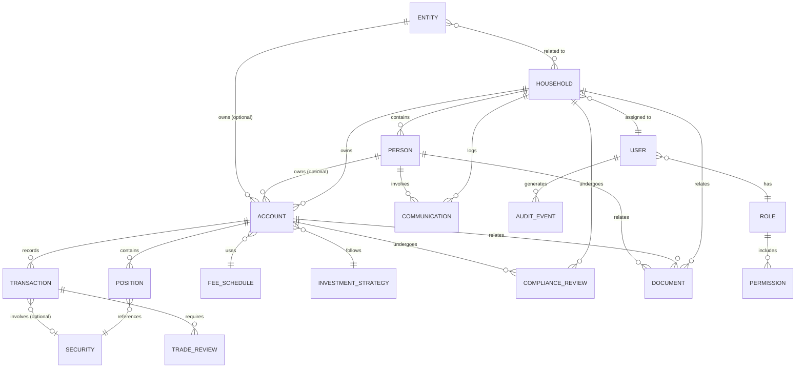

# Domain Model - Wealth Management CRM

## Table of Contents
1. [Overview](#overview)
2. [Entity Relationship Diagram](#entity-relationship-diagram)
3. [Core Entities](#core-entities)
4. [Relationship Cardinalities](#relationship-cardinalities)
5. [Business Rules and Constraints](#business-rules-and-constraints)
6. [Validation Requirements](#validation-requirements)
7. [Lifecycle States](#lifecycle-states)

## Overview

This document provides comprehensive documentation of all domain entities, their relationships, fields, validation rules, and business logic in the Wealth Management CRM system.

### Design Principles

- **Domain-Driven Design**: Entities organized around business domains
- **Strong Typing**: All fields strongly typed with constraints
- **Audit Trail**: All entities track creation and modification
- **Soft Deletes**: Critical entities marked deleted, not removed
- **Immutable History**: State changes preserved in audit tables

## Entity Relationship Diagram

### Core Domain Relationships



### Detailed Entity Relationships

```
┌────────────────┐
│   HOUSEHOLD    │
├────────────────┤
│ id (PK)        │
│ name           │
│ advisor_id (FK)│──────┐
│ primary_contact│────┐ │
│ ...            │    │ │
└────────────────┘    │ │
        │             │ │
        │ 1:N         │ │
        ├─────────────┘ │
        │               │
        ▼               │
┌────────────────┐      │
│     PERSON     │      │
├────────────────┤      │
│ id (PK)        │      │
│ household_id(FK│◀─────┘
│ first_name     │
│ last_name      │
│ ssn_encrypted  │
│ ...            │
└────────────────┘
        │
        │ 1:N
        │
        ▼
┌────────────────┐
│    ACCOUNT     │
├────────────────┤
│ id (PK)        │
│ household_id(FK│
│ owner_person_id│
│ owner_entity_id│
│ ...            │
└────────────────┘
        │
        │ 1:N
        │
        ▼
┌────────────────┐
│   POSITION     │
├────────────────┤
│ id (PK)        │
│ account_id (FK)│
│ security_id(FK)│
│ quantity       │
│ ...            │
└────────────────┘
```

## Core Entities

### 1. Household Entity

**Purpose**: Primary grouping entity for related persons and accounts

**Table**: `households`

#### Fields

| Field | Type | Constraints | Description |
|-------|------|-------------|-------------|
| `id` | UUID | PRIMARY KEY, NOT NULL | Unique identifier |
| `name` | VARCHAR(200) | NOT NULL | Household display name |
| `primary_contact_person_id` | UUID | FOREIGN KEY → persons.id | Primary contact person |
| `advisor_id` | UUID | NOT NULL, FOREIGN KEY → users.id | Assigned adviser |
| `risk_tolerance` | VARCHAR(20) | CHECK IN ('conservative', 'moderate', 'aggressive') | Risk tolerance level |
| `investment_objective` | TEXT | NOT NULL | Investment goals and objectives |
| `total_aum` | DECIMAL(15,2) | NOT NULL, DEFAULT 0 | Total AUM (calculated) |
| `status` | VARCHAR(20) | NOT NULL, CHECK IN ('prospect', 'active', 'inactive', 'closed') | Current status |
| `onboarding_date` | DATE | | Date household became client |
| `last_review_date` | DATE | | Date of last review |
| `next_review_date` | DATE | | Scheduled next review |
| `notes` | TEXT | | Internal notes |
| `metadata` | JSONB | | Additional flexible data |
| `created_at` | TIMESTAMPTZ | NOT NULL, DEFAULT NOW() | Creation timestamp |
| `updated_at` | TIMESTAMPTZ | NOT NULL, DEFAULT NOW() | Last update timestamp |
| `created_by` | UUID | NOT NULL, FOREIGN KEY → users.id | Creating user |
| `updated_by` | UUID | NOT NULL, FOREIGN KEY → users.id | Last updating user |
| `deleted_at` | TIMESTAMPTZ | | Soft delete timestamp |

#### Indexes

```sql
CREATE INDEX idx_households_advisor ON households(advisor_id) WHERE deleted_at IS NULL;
CREATE INDEX idx_households_status ON households(status) WHERE deleted_at IS NULL;
CREATE INDEX idx_households_next_review ON households(next_review_date) WHERE status = 'active';
CREATE INDEX idx_households_name_trgm ON households USING gin(name gin_trgm_ops);
```

#### Validation Rules

- `name`: 2-200 characters, required
- `advisor_id`: Must reference existing active user with adviser role
- `primary_contact_person_id`: If set, must be person in this household
- `total_aum`: Automatically calculated, cannot be set directly
- `onboarding_date`: Cannot be in future
- `next_review_date`: Must be after last_review_date

### 2. Person Entity

**Purpose**: Individual human entities (clients, beneficiaries, etc.)

**Table**: `persons`

#### Fields

| Field | Type | Constraints | Description |
|-------|------|-------------|-------------|
| `id` | UUID | PRIMARY KEY | Unique identifier |
| `household_id` | UUID | NOT NULL, FOREIGN KEY → households.id | Parent household |
| `first_name` | VARCHAR(100) | NOT NULL | First name |
| `middle_name` | VARCHAR(100) | | Middle name |
| `last_name` | VARCHAR(100) | NOT NULL | Last name |
| `suffix` | VARCHAR(20) | | Name suffix (Jr., Sr., III) |
| `preferred_name` | VARCHAR(100) | | Preferred name |
| `date_of_birth` | DATE | NOT NULL | Date of birth |
| `ssn_encrypted` | TEXT | | Encrypted SSN |
| `citizenship` | VARCHAR(2) | | Country code (ISO 3166-1) |
| `marital_status` | VARCHAR(20) | CHECK IN ('single', 'married', 'divorced', 'widowed', 'separated') | Marital status |
| `employment_status` | VARCHAR(50) | | Employment status |
| `employer` | VARCHAR(200) | | Employer name |
| `occupation` | VARCHAR(100) | | Occupation |
| `annual_income` | DECIMAL(15,2) | | Annual income |
| `net_worth` | DECIMAL(15,2) | | Net worth |
| `email` | VARCHAR(255) | | Email address |
| `phone_primary` | VARCHAR(20) | | Primary phone |
| `phone_mobile` | VARCHAR(20) | | Mobile phone |
| `address_street` | VARCHAR(200) | | Street address |
| `address_city` | VARCHAR(100) | | City |
| `address_state` | VARCHAR(50) | | State/Province |
| `address_zip` | VARCHAR(20) | | ZIP/Postal code |
| `address_country` | VARCHAR(2) | DEFAULT 'US' | Country code |
| `is_primary_contact` | BOOLEAN | DEFAULT FALSE | Is primary contact |
| `relationship_to_primary` | VARCHAR(50) | | Relationship type |
| `accredited_investor` | BOOLEAN | DEFAULT FALSE | Accredited investor status |
| `qualified_purchaser` | BOOLEAN | DEFAULT FALSE | Qualified purchaser status |
| `pep_status` | BOOLEAN | DEFAULT FALSE | Politically exposed person |
| `kyc_status` | VARCHAR(20) | NOT NULL, DEFAULT 'pending' | KYC verification status |
| `kyc_verified_date` | DATE | | KYC verification date |
| `kyc_verified_by` | UUID | FOREIGN KEY → users.id | Verifying user |
| `kyc_notes` | TEXT | | KYC verification notes |
| `metadata` | JSONB | | Additional flexible data |
| `created_at` | TIMESTAMPTZ | NOT NULL, DEFAULT NOW() | Creation timestamp |
| `updated_at` | TIMESTAMPTZ | NOT NULL, DEFAULT NOW() | Last update timestamp |
| `created_by` | UUID | NOT NULL | Creating user |
| `updated_by` | UUID | NOT NULL | Last updating user |
| `deleted_at` | TIMESTAMPTZ | | Soft delete timestamp |

#### Indexes

```sql
CREATE INDEX idx_persons_household ON persons(household_id) WHERE deleted_at IS NULL;
CREATE INDEX idx_persons_email ON persons(email) WHERE deleted_at IS NULL;
CREATE INDEX idx_persons_kyc_status ON persons(kyc_status) WHERE deleted_at IS NULL;
CREATE INDEX idx_persons_name ON persons(last_name, first_name);
```

#### Validation Rules

- `first_name`, `last_name`: 1-100 characters, required
- `date_of_birth`: Must be at least 18 years ago for account ownership
- `ssn_encrypted`: Must be encrypted before storage, format validated
- `email`: Valid email format, unique per household
- `phone_primary`, `phone_mobile`: Valid phone format
- `kyc_status`: Must be 'verified' before account opening
- Only one `is_primary_contact = true` per household

### 3. Entity (Legal Entity)

**Purpose**: Non-human legal entities (trusts, corporations, etc.)

**Table**: `entities`

#### Fields

| Field | Type | Constraints | Description |
|-------|------|-------------|-------------|
| `id` | UUID | PRIMARY KEY | Unique identifier |
| `household_id` | UUID | FOREIGN KEY → households.id | Related household (optional) |
| `entity_type` | VARCHAR(50) | NOT NULL, CHECK IN ('trust', 'corporation', 'llc', 'partnership', 'foundation', 'estate') | Entity type |
| `legal_name` | VARCHAR(300) | NOT NULL | Legal entity name |
| `doing_business_as` | VARCHAR(300) | | DBA name |
| `ein_encrypted` | TEXT | | Encrypted EIN |
| `state_of_formation` | VARCHAR(2) | | State code |
| `formation_date` | DATE | | Formation date |
| `registered_agent` | VARCHAR(200) | | Registered agent name |
| `address_street` | VARCHAR(200) | | Street address |
| `address_city` | VARCHAR(100) | | City |
| `address_state` | VARCHAR(50) | | State |
| `address_zip` | VARCHAR(20) | | ZIP code |
| `address_country` | VARCHAR(2) | DEFAULT 'US' | Country code |
| `purpose` | TEXT | | Entity purpose |
| `trustees` | JSONB | | Array of person IDs |
| `beneficiaries` | JSONB | | Array of person IDs |
| `authorized_signers` | JSONB | | Array of person IDs |
| `tax_status` | VARCHAR(50) | | Tax classification |
| `fiscal_year_end` | VARCHAR(5) | | Fiscal year end (MM-DD) |
| `kyc_status` | VARCHAR(20) | NOT NULL, DEFAULT 'pending' | KYC status |
| `kyc_verified_date` | DATE | | Verification date |
| `kyc_verified_by` | UUID | | Verifying user |
| `metadata` | JSONB | | Additional data |
| `created_at` | TIMESTAMPTZ | NOT NULL, DEFAULT NOW() | Creation timestamp |
| `updated_at` | TIMESTAMPTZ | NOT NULL, DEFAULT NOW() | Last update timestamp |
| `created_by` | UUID | NOT NULL | Creating user |
| `updated_by` | UUID | NOT NULL | Last updating user |
| `deleted_at` | TIMESTAMPTZ | | Soft delete timestamp |

#### Indexes

```sql
CREATE INDEX idx_entities_household ON entities(household_id) WHERE deleted_at IS NULL;
CREATE INDEX idx_entities_type ON entities(entity_type) WHERE deleted_at IS NULL;
CREATE INDEX idx_entities_kyc_status ON entities(kyc_status) WHERE deleted_at IS NULL;
```

#### Validation Rules

- `legal_name`: 2-300 characters, required
- `entity_type`: Required, must be valid type
- `ein_encrypted`: Required for most types, encrypted before storage
- `trustees`: Required for trust type, must reference existing persons
- `beneficiaries`: Required for trust/foundation types
- `kyc_status`: Must be 'verified' before account opening

### 4. Account Entity

**Purpose**: Investment accounts

**Table**: `accounts`

#### Fields

| Field | Type | Constraints | Description |
|-------|------|-------------|-------------|
| `id` | UUID | PRIMARY KEY | Unique identifier |
| `account_number` | VARCHAR(50) | NOT NULL, UNIQUE | Account number |
| `account_name` | VARCHAR(200) | NOT NULL | Account display name |
| `household_id` | UUID | NOT NULL, FOREIGN KEY → households.id | Parent household |
| `owner_person_id` | UUID | FOREIGN KEY → persons.id | Person owner (optional) |
| `owner_entity_id` | UUID | FOREIGN KEY → entities.id | Entity owner (optional) |
| `account_type` | VARCHAR(50) | NOT NULL | Account type |
| `custodian` | VARCHAR(100) | NOT NULL | Custodian name |
| `custodian_account_number` | VARCHAR(100) | | Custodian's account # |
| `registration` | TEXT | NOT NULL | Legal account registration |
| `tax_id_encrypted` | TEXT | | Encrypted tax ID |
| `inception_date` | DATE | NOT NULL | Account opening date |
| `status` | VARCHAR(20) | NOT NULL, DEFAULT 'pending' | Account status |
| `closed_date` | DATE | | Account close date |
| `closure_reason` | TEXT | | Reason for closure |
| `billing_method` | VARCHAR(20) | NOT NULL, DEFAULT 'arrears' | Billing method |
| `fee_schedule_id` | UUID | FOREIGN KEY → fee_schedules.id | Fee schedule |
| `management_style` | VARCHAR(30) | NOT NULL | Management style |
| `investment_strategy_id` | UUID | FOREIGN KEY → investment_strategies.id | Strategy |
| `restrictions` | TEXT | | Investment restrictions |
| `current_value` | DECIMAL(15,2) | NOT NULL, DEFAULT 0 | Current market value |
| `cost_basis` | DECIMAL(15,2) | NOT NULL, DEFAULT 0 | Total cost basis |
| `unrealized_gain_loss` | DECIMAL(15,2) | NOT NULL, DEFAULT 0 | Unrealized G/L |
| `last_statement_date` | DATE | | Last statement date |
| `last_reconciliation_date` | DATE | | Last reconciliation |
| `metadata` | JSONB | | Additional data |
| `created_at` | TIMESTAMPTZ | NOT NULL, DEFAULT NOW() | Creation timestamp |
| `updated_at` | TIMESTAMPTZ | NOT NULL, DEFAULT NOW() | Last update timestamp |
| `created_by` | UUID | NOT NULL | Creating user |
| `updated_by` | UUID | NOT NULL | Last updating user |
| `deleted_at` | TIMESTAMPTZ | | Soft delete timestamp |

**Valid Account Types**:
- `individual`: Individual taxable account
- `joint`: Joint account
- `trust`: Trust account
- `ira`: Traditional IRA
- `roth_ira`: Roth IRA
- `sep_ira`: SEP IRA
- `simple_ira`: SIMPLE IRA
- `401k`: 401(k) account
- `403b`: 403(b) account
- `529`: 529 education savings
- `custodial_ugma`: UGMA custodial
- `custodial_utma`: UTMA custodial
- `corporate`: Corporate account
- `partnership`: Partnership account
- `llc`: LLC account

**Valid Status Values**:
- `pending`: Account application in progress
- `active`: Account open and active
- `suspended`: Temporarily suspended
- `closed`: Account closed

**Valid Management Styles**:
- `discretionary`: Adviser has trading authority
- `non_discretionary`: Client approval required
- `advisory_only`: Advice only, no management

#### Indexes

```sql
CREATE UNIQUE INDEX idx_accounts_number ON accounts(account_number);
CREATE INDEX idx_accounts_household ON accounts(household_id) WHERE deleted_at IS NULL;
CREATE INDEX idx_accounts_status ON accounts(status) WHERE deleted_at IS NULL;
CREATE INDEX idx_accounts_owner_person ON accounts(owner_person_id) WHERE deleted_at IS NULL;
CREATE INDEX idx_accounts_owner_entity ON accounts(owner_entity_id) WHERE deleted_at IS NULL;
```

#### Validation Rules

- `account_number`: Unique, 5-50 characters
- `owner_person_id` OR `owner_entity_id`: At least one required
- `owner_person_id`: If set, person must be in household
- `owner_entity_id`: If set, entity must be related to household
- `inception_date`: Cannot be in future
- `status`: 'active' requires KYC verification
- `closed_date`: Required if status = 'closed'
- `current_value`, `cost_basis`: Non-negative

### 5. Security Entity

**Purpose**: Investment securities

**Table**: `securities`

#### Fields

| Field | Type | Constraints | Description |
|-------|------|-------------|-------------|
| `id` | UUID | PRIMARY KEY | Unique identifier |
| `symbol` | VARCHAR(20) | NOT NULL, UNIQUE | Ticker symbol |
| `cusip` | VARCHAR(9) | UNIQUE | CUSIP identifier |
| `isin` | VARCHAR(12) | UNIQUE | ISIN identifier |
| `security_type` | VARCHAR(50) | NOT NULL | Security type |
| `name` | VARCHAR(300) | NOT NULL | Security name |
| `description` | TEXT | | Detailed description |
| `exchange` | VARCHAR(50) | | Primary exchange |
| `currency` | VARCHAR(3) | NOT NULL, DEFAULT 'USD' | Currency code |
| `country` | VARCHAR(2) | | Country of issuance |
| `sector` | VARCHAR(100) | | Sector classification |
| `industry` | VARCHAR(100) | | Industry classification |
| `issuer` | VARCHAR(200) | | Issuing entity |
| `is_active` | BOOLEAN | NOT NULL, DEFAULT TRUE | Is actively traded |
| `delisted_date` | DATE | | Delisting date |
| `metadata` | JSONB | | Additional data (fund family, etc.) |
| `created_at` | TIMESTAMPTZ | NOT NULL, DEFAULT NOW() | Creation timestamp |
| `updated_at` | TIMESTAMPTZ | NOT NULL, DEFAULT NOW() | Last update timestamp |

**Valid Security Types**:
- `stock`: Common stock
- `preferred_stock`: Preferred stock
- `etf`: Exchange-traded fund
- `mutual_fund`: Mutual fund
- `bond_corporate`: Corporate bond
- `bond_government`: Government bond
- `bond_municipal`: Municipal bond
- `option`: Option contract
- `future`: Futures contract
- `cryptocurrency`: Cryptocurrency
- `cash`: Cash/Money market
- `alternative`: Alternative investment
- `real_estate`: Real estate
- `private_equity`: Private equity
- `other`: Other security type

#### Indexes

```sql
CREATE UNIQUE INDEX idx_securities_symbol ON securities(symbol) WHERE is_active = TRUE;
CREATE INDEX idx_securities_cusip ON securities(cusip) WHERE cusip IS NOT NULL;
CREATE INDEX idx_securities_type ON securities(security_type);
CREATE INDEX idx_securities_name_trgm ON securities USING gin(name gin_trgm_ops);
```

### 6. Position Entity

**Purpose**: Account holdings

**Table**: `positions`

#### Fields

| Field | Type | Constraints | Description |
|-------|------|-------------|-------------|
| `id` | UUID | PRIMARY KEY | Unique identifier |
| `account_id` | UUID | NOT NULL, FOREIGN KEY → accounts.id | Parent account |
| `security_id` | UUID | NOT NULL, FOREIGN KEY → securities.id | Security |
| `quantity` | DECIMAL(20,6) | NOT NULL | Quantity held |
| `cost_basis` | DECIMAL(15,2) | NOT NULL | Total cost basis |
| `cost_basis_per_share` | DECIMAL(15,6) | | Average cost per share |
| `current_price` | DECIMAL(15,6) | | Current market price |
| `current_value` | DECIMAL(15,2) | NOT NULL | Current market value |
| `unrealized_gain_loss` | DECIMAL(15,2) | NOT NULL | Unrealized G/L |
| `unrealized_gain_loss_pct` | DECIMAL(10,4) | | Unrealized G/L % |
| `as_of_date` | DATE | NOT NULL | Position as-of date |
| `last_updated` | TIMESTAMPTZ | NOT NULL, DEFAULT NOW() | Last price update |

#### Indexes

```sql
CREATE INDEX idx_positions_account ON positions(account_id);
CREATE INDEX idx_positions_security ON positions(security_id);
CREATE INDEX idx_positions_as_of_date ON positions(as_of_date);
CREATE UNIQUE INDEX idx_positions_unique ON positions(account_id, security_id, as_of_date);
```

#### Validation Rules

- `quantity`: Can be negative (short positions), not zero
- `current_value`: Must equal quantity * current_price
- `unrealized_gain_loss`: Must equal current_value - cost_basis
- Unique constraint: One position per account/security/date

### 7. Transaction Entity

**Purpose**: Account transactions

**Table**: `transactions`

#### Fields

| Field | Type | Constraints | Description |
|-------|------|-------------|-------------|
| `id` | UUID | PRIMARY KEY | Unique identifier |
| `account_id` | UUID | NOT NULL, FOREIGN KEY → accounts.id | Account |
| `transaction_type` | VARCHAR(50) | NOT NULL | Transaction type |
| `security_id` | UUID | FOREIGN KEY → securities.id | Security (optional) |
| `trade_date` | DATE | NOT NULL | Trade date |
| `settlement_date` | DATE | | Settlement date |
| `quantity` | DECIMAL(20,6) | | Quantity (for securities) |
| `price` | DECIMAL(15,6) | | Price per unit |
| `amount` | DECIMAL(15,2) | NOT NULL | Total amount |
| `fee` | DECIMAL(15,2) | DEFAULT 0 | Transaction fee |
| `description` | TEXT | | Description |
| `confirmation_number` | VARCHAR(100) | | Custodian confirmation |
| `status` | VARCHAR(20) | NOT NULL, DEFAULT 'pending' | Status |
| `cancelled_date` | DATE | | Cancellation date |
| `cancellation_reason` | TEXT | | Reason for cancellation |
| `related_transaction_id` | UUID | FOREIGN KEY → transactions.id | Related transaction |
| `metadata` | JSONB | | Additional data |
| `created_at` | TIMESTAMPTZ | NOT NULL, DEFAULT NOW() | Creation timestamp |
| `created_by` | UUID | NOT NULL | Creating user |

**Valid Transaction Types**:
- `buy`: Buy security
- `sell`: Sell security
- `dividend`: Dividend payment
- `interest`: Interest payment
- `deposit`: Cash deposit
- `withdrawal`: Cash withdrawal
- `transfer_in`: Transfer in
- `transfer_out`: Transfer out
- `fee`: Advisory fee
- `rebalance`: Rebalancing transaction
- `corporate_action`: Corporate action
- `other`: Other transaction

**Valid Status Values**:
- `pending`: Awaiting execution
- `executed`: Executed, awaiting settlement
- `settled`: Settled
- `cancelled`: Cancelled

#### Indexes

```sql
CREATE INDEX idx_transactions_account ON transactions(account_id);
CREATE INDEX idx_transactions_security ON transactions(security_id) WHERE security_id IS NOT NULL;
CREATE INDEX idx_transactions_trade_date ON transactions(trade_date);
CREATE INDEX idx_transactions_type ON transactions(transaction_type);
CREATE INDEX idx_transactions_status ON transactions(status);
```

#### Validation Rules

- `settlement_date`: Must be >= trade_date
- `quantity`: Required for security transactions
- `price`: Required for buy/sell transactions
- `amount`: Must be positive for deposits/dividends, can be negative for withdrawals/fees
- `status`: Cannot change from 'settled' to other status
- Immutable after settlement (create correction transaction instead)

## Relationship Cardinalities

### One-to-Many Relationships

| Parent | Child | Cardinality | Description |
|--------|-------|-------------|-------------|
| Household | Person | 1:N | One household has many persons |
| Household | Account | 1:N | One household has many accounts |
| Household | Document | 1:N | One household has many documents |
| Household | Communication | 1:N | One household has many communications |
| Account | Position | 1:N | One account has many positions |
| Account | Transaction | 1:N | One account has many transactions |
| User | Household | 1:N | One adviser manages many households |

### Many-to-One Relationships

| Child | Parent | Description |
|-------|--------|-------------|
| Person | Household | Many persons belong to one household |
| Account | Person | Many accounts can be owned by one person |
| Account | Entity | Many accounts can be owned by one entity |
| Position | Security | Many positions reference one security |
| Transaction | Security | Many transactions involve one security |

### Optional Relationships

- Person → Account: Person may own zero or more accounts
- Entity → Account: Entity may own zero or more accounts
- Entity → Household: Entity may be independent or related to household
- Transaction → Security: Cash transactions have no security

### Enforced Relationships

- Account MUST have household_id
- Account MUST have either owner_person_id OR owner_entity_id
- Person MUST have household_id
- Transaction MUST have account_id

## Business Rules and Constraints

### Household Rules

1. **Primary Contact**: Must be a person within the household
2. **Adviser Assignment**: Required, must be active user with adviser role
3. **AUM Calculation**: Automatically calculated from account values
4. **Status Transitions**:
   - `prospect` → `active`: Requires at least one active account
   - `active` → `inactive`: All accounts must be inactive/closed
   - `active` → `closed`: All accounts must be closed
5. **Review Schedule**: `next_review_date` must be set when status = 'active'

### Person Rules

1. **Age Requirement**: Must be 18+ to be account owner
2. **SSN**: Required for US citizens/residents owning accounts
3. **KYC Verification**: Required before account opening
4. **Primary Contact**: Only one per household
5. **Email Uniqueness**: Unique within household
6. **PEP Status**: If true, requires enhanced due diligence

### Entity Rules

1. **Trust Requirements**:
   - Must have at least one trustee
   - Must have at least one beneficiary
   - Requires trust documents
2. **Corporation Requirements**:
   - Must have EIN
   - Must have authorized signers
   - Requires formation documents
3. **Beneficial Ownership**: Must track ultimate beneficial owners (25%+ ownership)

### Account Rules

1. **Owner Requirements**: Must have person OR entity owner
2. **Owner Validation**: Owner must be part of household
3. **Status Transitions**:
   - `pending` → `active`: Requires KYC verification, signed agreement
   - `active` → `suspended`: Requires compliance approval
   - `active` → `closed`: Requires zero balance, compliance approval
4. **Account Types**: IRA/retirement accounts can only be person-owned
5. **Registration**: Must match legal account registration at custodian

### Transaction Rules

1. **Immutability**: Transactions immutable after settlement
2. **Corrections**: Create offsetting transaction, reference original
3. **Buy/Sell**: Requires security, quantity, price
4. **Cash Transactions**: No security, amount only
5. **Settlement**: T+1 for stocks, T+2 for options, immediate for mutual funds
6. **Approval**: Discretionary transactions require compliance pre-approval

### Position Rules

1. **Uniqueness**: One position per account/security/date
2. **Reconciliation**: Positions reconcile to transactions
3. **Zero Positions**: Remove positions when quantity = 0
4. **Historical**: Maintain historical positions for reporting

## Validation Requirements

### Field-Level Validation

#### String Fields
```typescript
// Name fields
const NAME_REGEX = /^[A-Za-z\s'-]+$/;
const NAME_MIN_LENGTH = 1;
const NAME_MAX_LENGTH = 100;

// Email validation
const EMAIL_REGEX = /^[^\s@]+@[^\s@]+\.[^\s@]+$/;

// Phone validation
const PHONE_REGEX = /^\+?[1-9]\d{1,14}$/; // E.164 format

// Account number
const ACCOUNT_NUMBER_REGEX = /^[A-Z0-9]{5,50}$/;
```

#### Numeric Fields
```typescript
// Monetary amounts
const MIN_AMOUNT = 0;
const MAX_AMOUNT = 999999999999.99; // $999 billion
const DECIMAL_PLACES = 2;

// Percentages
const MIN_PERCENTAGE = 0;
const MAX_PERCENTAGE = 100;
const PERCENTAGE_DECIMAL_PLACES = 4;

// Quantities
const MAX_QUANTITY_DECIMAL_PLACES = 6;
```

#### Date Fields
```typescript
// Date of birth
const MIN_AGE = 18;
const MAX_AGE = 120;

// Inception date
const MIN_INCEPTION_DATE = new Date('1900-01-01');
const MAX_INCEPTION_DATE = new Date(); // Today
```

### Entity-Level Validation

#### Household Validation
```typescript
interface HouseholdValidation {
  name: {
    required: true;
    minLength: 2;
    maxLength: 200;
  };
  advisorId: {
    required: true;
    exists: 'users.id';
    where: { role: 'adviser', status: 'active' };
  };
  primaryContactPersonId: {
    required: false;
    exists: 'persons.id';
    where: { householdId: 'this.id' };
  };
  riskTolerance: {
    required: true;
    in: ['conservative', 'moderate', 'aggressive'];
  };
}
```

#### Account Validation
```typescript
interface AccountValidation {
  accountNumber: {
    required: true;
    unique: true;
    pattern: /^[A-Z0-9]{5,50}$/;
  };
  householdId: {
    required: true;
    exists: 'households.id';
  };
  ownerValidation: {
    custom: (account) => {
      return account.ownerPersonId || account.ownerEntityId;
    };
    message: 'Account must have person or entity owner';
  };
  statusTransition: {
    custom: (newStatus, oldStatus) => {
      const validTransitions = {
        pending: ['active', 'closed'],
        active: ['suspended', 'closed'],
        suspended: ['active', 'closed'],
        closed: [] // Cannot transition from closed
      };
      return validTransitions[oldStatus]?.includes(newStatus);
    };
  };
}
```

## Lifecycle States

### Household Lifecycle

```
┌──────────┐
│ Prospect │  Initial state
└────┬─────┘
     │ onboard_client()
     ▼
┌──────────┐
│  Active  │  Has active accounts
└────┬─────┘
     │ deactivate()
     ▼
┌──────────┐
│ Inactive │  No active accounts
└────┬─────┘
     │ close_household()
     ▼
┌──────────┐
│  Closed  │  All accounts closed (terminal state)
└──────────┘
```

**State Transitions**:
- `prospect` → `active`: Add first active account
- `active` → `inactive`: All accounts inactive
- `inactive` → `active`: Reactivate account
- `active`/`inactive` → `closed`: Close all accounts

### Account Lifecycle

```
┌─────────┐
│ Pending │  Application submitted
└────┬────┘
     │ approve_account()
     ▼
┌─────────┐
│ Active  │  Account open and operational
└────┬────┘
     │ suspend_account()
     ▼
┌──────────┐
│Suspended │  Temporarily suspended
└────┬─────┘
     │ reactivate() or close_account()
     ▼
┌─────────┐
│ Closed  │  Account closed (terminal state)
└─────────┘
```

**State Transitions**:
- `pending` → `active`: KYC verified, agreement signed, initial funding
- `pending` → `closed`: Application rejected/abandoned
- `active` → `suspended`: Compliance issue, missing documents
- `suspended` → `active`: Issue resolved
- `active`/`suspended` → `closed`: Client request, firm decision

### Transaction Lifecycle

```
┌─────────┐
│ Pending │  Transaction requested
└────┬────┘
     │ execute_trade()
     ▼
┌──────────┐
│ Executed │  Trade executed, awaiting settlement
└────┬─────┘
     │ settle() or cancel()
     ├─────────────┐
     ▼             ▼
┌─────────┐   ┌───────────┐
│ Settled │   │ Cancelled │  (terminal states)
└─────────┘   └───────────┘
```

**State Transitions**:
- `pending` → `executed`: Order filled
- `pending` → `cancelled`: Order cancelled before execution
- `executed` → `settled`: Settlement date reached
- `executed` → `cancelled`: Rare, trade bust

### KYC Status Lifecycle

```
┌─────────┐
│ Pending │  KYC initiated
└────┬────┘
     │ review_kyc()
     ├──────────────┐
     ▼              ▼
┌──────────┐   ┌────────┐
│ Verified │   │ Failed │
└──────────┘   └───┬────┘
                   │ retry_kyc()
                   └─────────────┐
                                 ▼
                           ┌─────────┐
                           │ Pending │
                           └─────────┘
```

**State Transitions**:
- `pending` → `verified`: KYC checks passed
- `pending` → `failed`: KYC checks failed
- `failed` → `pending`: Retry KYC process

---

**Document Version**: 1.0  
**Last Updated**: 2024-01-15  
**Owner**: Engineering & Product Team  
**Classification**: Internal Use Only
