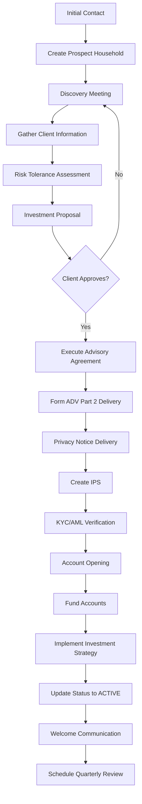
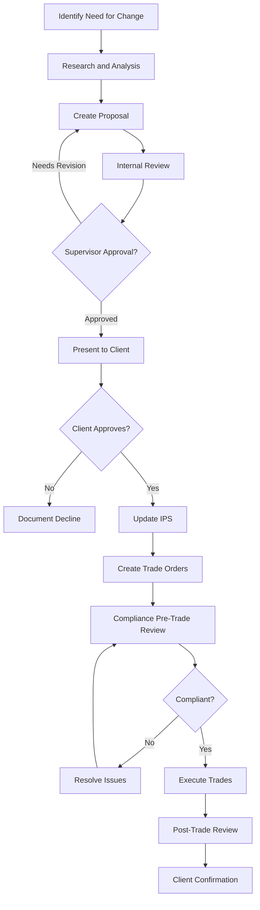
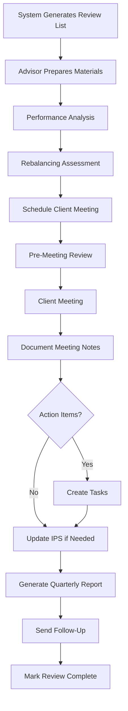
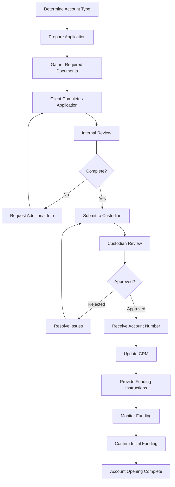
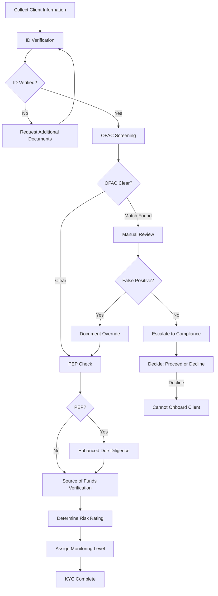
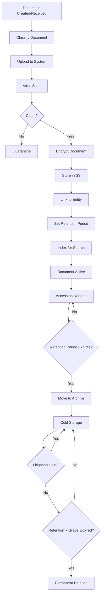
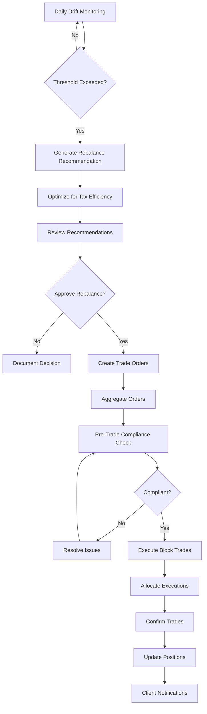

# Business Workflows - Wealth Management CRM

## Table of Contents
- [Overview](#overview)
- [Client Onboarding Workflow](#client-onboarding-workflow)
- [Investment Proposal and Approval](#investment-proposal-and-approval)
- [Quarterly Review Cycle](#quarterly-review-cycle)
- [Account Opening Process](#account-opening-process)
- [KYC/AML Verification](#kycaml-verification)
- [Compliance Review Workflows](#compliance-review-workflows)
- [Document Management Lifecycle](#document-management-lifecycle)
- [Rebalancing and Trade Execution](#rebalancing-and-trade-execution)

## Overview

This document describes the key business workflows supported by the Wealth Management CRM. Each workflow is designed to ensure compliance, maintain audit trails, and provide excellent client service.

### Workflow Principles

1. **Compliance First**: Every workflow incorporates required compliance checks
2. **Audit Trail**: All steps logged for regulatory examination
3. **Approval Gates**: Multi-level approvals for sensitive operations
4. **Automation**: Reduce manual work while maintaining control
5. **Client Communication**: Keep clients informed throughout process
6. **Error Handling**: Clear escalation paths for issues

## Client Onboarding Workflow

### Overview
Process for bringing new clients from prospect to active managed client.

### Timeline
- Typical duration: 2-4 weeks
- Fast track: 1 week (for simple situations)
- Complex (trusts, entities): 4-8 weeks

### Workflow Steps

### Detailed Steps

#### Step 1: Initial Contact (Day 0)
**Responsible**: Lead Advisor

**Actions:**
1. Prospect reaches out (referral, web form, phone)
2. Create household record with status = PROSPECT
3. Log initial communication
4. Schedule discovery meeting
5. Send meeting confirmation

**System Support:**
- Quick household creation form
- Communication logging
- Calendar integration
- Automated confirmation email

**Compliance:**
- Log all contact information
- Document referral source (marketing attribution)

#### Step 2: Discovery Meeting (Day 1-3)
**Responsible**: Lead Advisor

**Actions:**
1. Understand client goals and objectives
2. Explain firm's services and fee structure
3. Gather preliminary financial information
4. Assess fit for firm's service model
5. Document meeting notes

**System Support:**
- Discovery meeting checklist
- Meeting notes template
- Goal capture form
- Fee calculator

**Required Information:**
- Financial goals
- Current assets and liabilities
- Income and expenses
- Investment experience
- Risk tolerance (preliminary)
- Time horizon
- Special circumstances

#### Step 3: Risk Tolerance Assessment (Day 3-5)
**Responsible**: Lead Advisor or Associate Advisor

**Actions:**
1. Client completes risk tolerance questionnaire
2. Review and discuss results with client
3. Document risk tolerance level
4. Align with investment objectives

**System Support:**
- Digital risk questionnaire
- Scoring algorithm
- Results visualization
- Advisor override capability (with documentation)

**Risk Levels:**
- Conservative: Capital preservation, minimal volatility
- Moderate: Balanced growth and income
- Growth: Long-term appreciation, accept volatility
- Aggressive: Maximum growth, high volatility tolerance

#### Step 4: Investment Proposal (Day 5-7)
**Responsible**: Lead Advisor

**Actions:**
1. Create proposed asset allocation
2. Select model portfolio or custom strategy
3. Calculate projected fees
4. Generate proposal document
5. Present to client
6. Document client questions and responses

**System Support:**
- Model portfolio library
- Asset allocation tool
- Fee projection calculator
- Proposal generator
- eSignature integration

**Proposal Contents:**
- Recommended asset allocation
- Expected return and risk metrics
- Fee schedule
- Service level agreement
- Benchmark selection

#### Step 5: Execute Advisory Agreement (Day 7-10)
**Responsible**: Lead Advisor, Compliance

**Actions:**
1. Prepare investment advisory agreement
2. Client reviews agreement
3. Client signs agreement (eSignature or wet signature)
4. Compliance review and countersign
5. Store signed agreement in document management

**System Support:**
- Agreement template management
- eSignature workflow
- Compliance approval queue
- Document storage with retention policy

**Required Agreements:**
- Investment Advisory Agreement
- Form ADV Part 2A delivery acknowledgment
- Form ADV Part 2B (brochure supplement)
- Privacy Notice acknowledgment
- IPS acknowledgment

#### Step 6: KYC/AML Verification (Day 10-14)
**Responsible**: Operations, Compliance

**Actions:**
1. Collect identification documents
2. Verify identity (ID verification service)
3. OFAC sanctions screening
4. PEP (Politically Exposed Person) check
5. Determine accredited investor status
6. Document verification results

**System Support:**
- ID verification integration (Onfido, Jumio)
- OFAC screening automation
- Document upload portal
- Verification workflow
- Status tracking dashboard

**Required Documents:**
- Government-issued ID (driver's license, passport)
- Proof of address (utility bill, bank statement)
- Social Security card or W-9
- Entity documents (if trust, LLC, etc.)

#### Step 7: Account Opening (Day 14-21)
**Responsible**: Operations

**Actions:**
1. Prepare custodian account applications
2. Client reviews and signs applications
3. Submit to custodian(s)
4. Track application status
5. Receive account numbers
6. Link accounts in CRM

**System Support:**
- Account opening workflow
- Custodian integration (pre-fill forms)
- Application tracking
- Status notifications
- Account import

**Account Types:**
- Individual brokerage
- Joint brokerage
- Traditional IRA
- Roth IRA
- Trust accounts
- Entity accounts

#### Step 8: Fund Accounts (Day 21-28)
**Responsible**: Operations, Client

**Actions:**
1. Provide funding instructions to client
2. Monitor incoming transfers
3. Reconcile cash receipts
4. Document funding source (AML requirement)
5. Confirm full funding received

**Funding Methods:**
- ACH transfer
- Wire transfer
- ACAT (account transfer from another custodian)
- Check deposit
- In-kind securities transfer

#### Step 9: Implement Investment Strategy (Day 28-30)
**Responsible**: Lead Advisor, Portfolio Manager

**Actions:**
1. Create trade orders per IPS
2. Review and approve trades
3. Execute trades
4. Monitor execution
5. Confirm final allocation
6. Generate confirmation letter

**System Support:**
- Trade order management
- Model portfolio application
- Rebalancing tool
- Trade approval workflow
- Execution tracking

#### Step 10: Activate Client (Day 30)
**Responsible**: Lead Advisor

**Actions:**
1. Update household status to ACTIVE
2. Set billing start date
3. Send welcome packet
4. Schedule first quarterly review
5. Add to portfolio monitoring

**System Support:**
- Status update with audit logging
- Automated welcome email
- Calendar scheduling
- Billing activation

#### Step 11: Ongoing Service
**Responsible**: Lead Advisor, Team

**Actions:**
1. Quarterly reviews
2. Annual IPS review
3. Regular performance reporting
4. Proactive communication
5. Tax planning discussions

### Onboarding Checklist

System provides dynamic checklist showing completion status:

- [ ] Household created
- [ ] Discovery meeting completed
- [ ] Risk tolerance assessed
- [ ] Investment proposal presented
- [ ] Proposal accepted
- [ ] Advisory agreement signed
- [ ] Form ADV Part 2 delivered
- [ ] Privacy notice delivered
- [ ] IPS created and signed
- [ ] KYC verification completed
- [ ] OFAC screening passed
- [ ] Account applications submitted
- [ ] Accounts opened
- [ ] Accounts funded
- [ ] Initial investment executed
- [ ] Status changed to ACTIVE
- [ ] Welcome packet sent
- [ ] Quarterly review scheduled

### Compliance Requirements

**Documentation:**
- All meetings logged
- Client instructions documented
- Proposal and alternatives discussed
- Agreement delivery confirmed
- KYC/AML verification complete
- Account opening documents retained

**Timing:**
- Form ADV Part 2 must be delivered before or at time of agreement signing
- IPS must be created before initial investment
- KYC must be completed before account funding

## Investment Proposal and Approval

### Overview
Process for proposing and implementing investment recommendations.

### Workflow Types

1. **Initial Investment** (during onboarding)
2. **Strategy Change** (existing client portfolio modification)
3. **New Account Addition** (client opens additional account)
4. **Rebalancing** (periodic realignment)

### Strategy Change Workflow

### Proposal Components

**Executive Summary:**
- Current situation
- Recommended changes
- Rationale for changes
- Expected impact

**Analysis:**
- Current allocation vs. target
- Performance attribution
- Risk metrics
- Tax implications
- Fee impact

**Recommendation:**
- New asset allocation
- Specific securities to buy/sell
- Implementation timeline
- Expected outcomes

**Required Disclosures:**
- Conflicts of interest
- Risks
- Alternatives considered
- Fee changes (if any)

### Approval Levels

**Standard Proposals (< $100k traded):**
- Lead Advisor approval only

**Significant Proposals ($100k - $500k):**
- Lead Advisor + Supervisor approval

**Major Proposals (> $500k):**
- Lead Advisor + Supervisor + Chief Investment Officer approval

**Strategy Change (any amount):**
- Lead Advisor + Compliance Officer review

### System Support

**Proposal Builder:**
- Current holdings display
- Target allocation modeling
- Trade impact preview
- Performance projection
- Fee calculation
- PDF generation

**Approval Workflow:**
- Automatic routing based on rules
- Approval queue for supervisors
- Email notifications
- Audit trail
- Client presentation mode

## Quarterly Review Cycle

### Overview
Regular review process for all active clients to ensure ongoing suitability.

### Timeline
- Reviews conducted quarterly
- Preparation begins 2 weeks before meeting
- Follow-up actions within 1 week after meeting

### Quarterly Review Process

### Review Materials

**Performance Report:**
- Account performance (time-weighted return)
- Benchmark comparison
- Attribution analysis
- Top performers/detractors

**Holdings Report:**
- Current positions
- Allocation by asset class
- Allocation vs. target
- Concentration analysis

**Transaction Summary:**
- Trades executed
- Cash flows
- Fees deducted

**Market Commentary:**
- Market review (quarter and YTD)
- Economic outlook
- Portfolio positioning

### Meeting Agenda

**Standard Agenda:**
1. Life changes (5 min)
   - Employment, family, health
   - Upcoming expenses
   - Risk tolerance still appropriate?

2. Portfolio review (15 min)
   - Performance vs. benchmark
   - Asset allocation
   - Individual holdings discussion
   - Rebalancing needs

3. Market outlook (5 min)
   - Economic environment
   - Our positioning
   - Opportunities and risks

4. Planning topics (10 min)
   - Tax planning
   - Estate planning
   - Retirement planning
   - Other planning areas

5. Next steps (5 min)
   - Action items
   - Next meeting date
   - Questions

### Documentation

**Required Documentation:**
- Meeting date and attendees
- Life changes discussed
- Portfolio performance reviewed
- Rebalancing recommendations
- Client questions and advisor responses
- Client instructions
- Follow-up actions

**System Support:**
- Meeting notes template
- Quick capture during meeting
- Audio recording option (with consent)
- Action item creation
- Next meeting scheduling

## Account Opening Process

### Overview
Detailed process for opening new accounts at custodians.

### Account Opening Workflow

### Account Types and Requirements

#### Individual Brokerage
**Required Documents:**
- Account application
- W-9 (tax form)
- ID verification
- Investment profile

**Typical Timeline:** 3-5 business days

#### Joint Brokerage
**Required Documents:**
- Account application (both owners)
- W-9 (both SSNs)
- ID verification (both owners)
- Investment profile
- Joint account agreement

**Typical Timeline:** 5-7 business days

#### Traditional IRA / Roth IRA
**Required Documents:**
- IRA application
- W-9
- ID verification
- Beneficiary designation
- Investment profile

**Additional Requirements:**
- Contribution limits verification
- Income eligibility (Roth)
- Transfer paperwork (if rollover)

**Typical Timeline:** 5-10 business days

#### Trust Account
**Required Documents:**
- Trust account application
- Complete trust document (certified copy)
- W-9 (trust EIN)
- Trustee identification
- Beneficiary information
- Investment profile

**Additional Requirements:**
- Trust review by custodian legal
- Trustee authority verification

**Typical Timeline:** 10-15 business days

### Funding Methods

**ACH Transfer:**
- Setup bank link at custodian
- Micro-deposit verification (1-2 days)
- Initiate transfer
- Receipt in 3-5 business days

**Wire Transfer:**
- Provide wiring instructions
- Client initiates wire at bank
- Receipt same or next business day

**ACAT Transfer:**
- Complete transfer form
- Client signs LOA (Letter of Authorization)
- Submit to current custodian
- Transfer completes in 5-7 business days

**Check:**
- Client mails check to custodian
- Receipt in 5-10 days (mail time)
- Check clearing time (5-7 days)

**In-Kind Securities:**
- DTC transfer for publicly traded securities
- Transfer form with detailed holdings
- Timeline: 7-10 business days

### System Support

**Account Opening Module:**
- Account type selector
- Dynamic document checklist
- Application pre-fill from household data
- Document upload and storage
- Status tracking dashboard
- Custodian submission integration
- Automated reminders

**Monitoring:**
- Application status updates
- Funding status tracking
- Exception handling
- Escalation for delays

## KYC/AML Verification

### Overview
Know Your Customer (KYC) and Anti-Money Laundering (AML) verification process.

### KYC/AML Workflow

### Identity Verification

**Level 1: Document Verification**
- Government-issued photo ID (driver's license, passport)
- Verify name, DOB, address match application
- Check document authenticity

**Level 2: Database Verification**
- Cross-reference against credit bureaus
- Verify SSN
- Confirm address history

**Level 3: Biometric Verification** (high-risk)
- Facial recognition
- Liveness detection
- Match photo ID to live selfie

### OFAC Screening

**Process:**
1. Screen name against OFAC Specially Designated Nationals (SDN) list
2. Check aliases and alternate spellings
3. Consider date of birth, address if available
4. Document results

**Match Handling:**
- Exact name match → Manual review required
- Close name match → Document why not a match
- False positive → Document reasoning

**Frequency:**
- Initial screening before account opening
- Quarterly re-screening of all active clients
- Real-time screening for large transactions

### Politically Exposed Person (PEP)

**Definition:**
- Current or former government officials
- High-ranking political party members
- Senior executives of state-owned corporations
- Close associates and family members

**Enhanced Due Diligence:**
- Source of wealth documentation
- Purpose of account
- Expected activity levels
- Ongoing monitoring of transactions

### Source of Funds

**Documentation Required:**
- Employment verification
- Tax returns
- Bank statements
- Investment account statements
- Inheritance documentation (if applicable)
- Business ownership documents

**Risk Factors:**
- Vague employment
- Cash-intensive business
- Source inconsistent with stated occupation
- Unwilling to provide documentation

### Risk Rating

**Low Risk:**
- Salaried employee
- Clear source of funds
- Moderate account size
- Domestic transactions only
- No PEP status

**Medium Risk:**
- Self-employed
- Multiple funding sources
- Larger account size
- Some international exposure

**High Risk:**
- Cash-intensive business
- Foreign nationals
- PEP status
- Large account size (> $10M)
- Cryptocurrency involvement
- High-risk jurisdictions

**Monitoring Levels:**
- Low: Annual review
- Medium: Quarterly review
- High: Monthly review + transaction monitoring

### System Support

**KYC Module:**
- ID verification integration (Onfido, Jumio)
- Automated OFAC screening
- PEP database integration
- Document collection workflow
- Risk scoring algorithm
- Verification status dashboard
- Compliance review queue

## Compliance Review Workflows

### Overview
Periodic compliance reviews to ensure adherence to policies and regulations.

### Annual Compliance Review

**Scope:**
- All policies and procedures
- All advisor activities
- Sample client files
- Marketing materials
- Personal trading
- Outside business activities

**Timeline:**
- Completed within 120 days of fiscal year end
- Findings documented
- Remediation plan created
- Board presentation

### Client File Review

**Random Sample:**
- 10% of active households selected quarterly
- Stratified by advisor

**Review Checklist:**
- [ ] Advisory agreement on file
- [ ] Current IPS on file and signed
- [ ] Form ADV Part 2 delivery documented
- [ ] Privacy notice delivery documented
- [ ] KYC/AML verification complete
- [ ] Account opening documents complete
- [ ] Fee billing accurate
- [ ] Meeting notes documenting annual review
- [ ] Suitability determination documented
- [ ] Risk tolerance assessment current

**Findings:**
- Document any deficiencies
- Create remediation tasks
- Set deadline for correction
- Follow-up review

### Trading Review

**Pre-Trade Review:**
- Large trades (> $250k) reviewed before execution
- Compliance approval required
- Check for conflicts, restrictions
- Best execution verification

**Post-Trade Review:**
- Sample of trades reviewed weekly
- Fair allocation verification
- Best execution analysis
- Error identification

### Marketing Materials Review

**Process:**
1. All marketing materials submitted to compliance
2. Compliance reviews for:
   - Performance claims (calculation methodology)
   - Required disclosures
   - Testimonial compliance
   - Misleading statements
3. Approval or revision request
4. Track approved materials
5. Annual re-review

## Document Management Lifecycle

### Overview
Complete lifecycle for managing client and firm documents.

### Document Lifecycle Workflow

### Document Classification

**Categories:**
- Legal (agreements, contracts)
- Compliance (Form ADV, disclosures)
- Financial (statements, tax documents)
- Planning (IPS, financial plans)
- Correspondence (emails, letters)
- Marketing (presentations, materials)

**Types:**
- Investment Advisory Agreement
- IPS (Investment Policy Statement)
- Form ADV Part 2A/2B
- Privacy Notice
- Account Application
- Account Statement
- Performance Report
- Tax Documents (1099, K-1)
- Meeting Notes
- Email Correspondence

### Retention Periods

| Document Type | Retention Period | Trigger |
|--------------|------------------|---------|
| Advisory Agreement | 6 years | After termination |
| IPS | 6 years | After termination |
| Form ADV | 6 years | After filing |
| Account Statements | 6 years | After statement date |
| Trade Confirmations | 6 years | After trade date |
| Correspondence | 6 years | After date |
| Meeting Notes | 6 years | After meeting |
| Marketing Materials | 6 years | After last use |

### Version Control

**Versioning:**
- Each upload creates new version
- Previous versions retained
- Version history tracked
- Can restore previous version

**Major Versions:**
- IPS revisions (1.0, 2.0, 3.0)
- Agreement amendments
- Policy updates

**Minor Versions:**
- Formatting changes
- Typo corrections

### Access Control

**Permissions:**
- View: Can see document
- Download: Can download file
- Upload: Can add new documents
- Delete: Can remove documents (soft delete only)

**Audit Trail:**
- Every document access logged
- Download tracking
- Modification history
- Deletion tracking

## Rebalancing and Trade Execution

### Overview
Process for rebalancing portfolios and executing trades.

### Rebalancing Workflow

### Rebalancing Triggers

**Threshold-Based:**
- Any asset class > 5% away from target
- Any individual security > 10% of portfolio
- Cash level > 5% of portfolio

**Calendar-Based:**
- Quarterly rebalancing for all accounts
- Annual comprehensive review

**Tax-Loss Harvesting:**
- Ongoing monitoring for losses > $3,000
- End-of-year optimization

**Cash Flow:**
- New deposits or withdrawals
- Required Minimum Distributions (RMDs)

### Trade Execution Process

**Order Types:**
- Market orders (immediate execution)
- Limit orders (price protection)
- Stop-loss orders (risk management)

**Execution Methods:**
- Block trades (aggregate similar orders)
- VWAP (Volume Weighted Average Price)
- TWAP (Time Weighted Average Price)
- Algorithmic execution for large orders

**Fair Allocation:**
- Pro-rata allocation of block trades
- Price averaging across accounts
- No preferential treatment
- Document allocation method

### Best Execution

**Factors Considered:**
- Price
- Speed of execution
- Likelihood of execution
- Commission costs
- Impact costs (market impact)

**Documentation:**
- Execution venue
- Execution time
- Fill price
- Commission
- Comparison to NBBO (National Best Bid Offer)

### Post-Trade Review

**Verification:**
- Confirm all trades executed
- Verify allocations correct
- Check for trade errors
- Compare to benchmarks

**Error Handling:**
- Identify trade errors
- Document error cause
- Correct error (rebill if needed)
- Client notification if material
- Report to compliance

---

**Document Version**: 1.0  
**Last Updated**: 2024-12-22  
**Owner**: Operations Team  
**Review Cycle**: Semi-Annual
